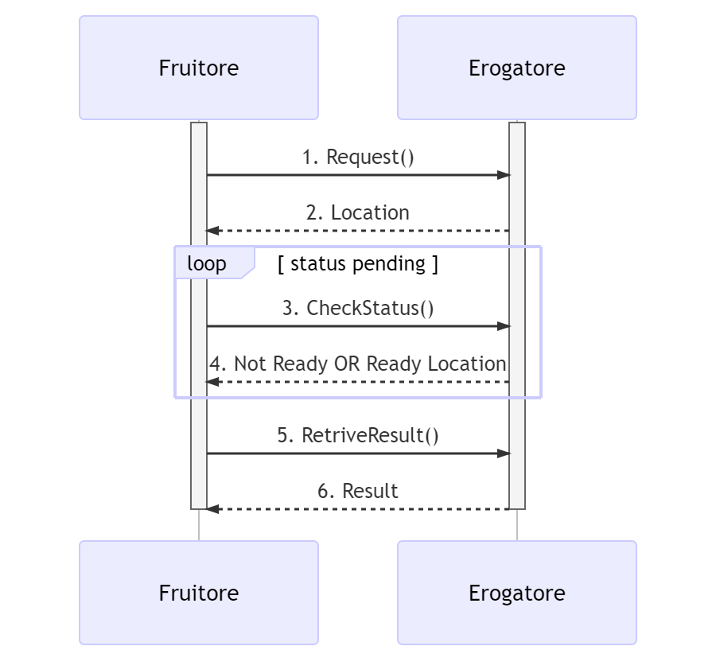

Pattern non bloccanti RPC PULL (busy waiting)
=============================================

Questo pattern è simile al precedente, di cui eredita le motivazioni, ma
in questo caso il fruitore non fornisce un indirizzo di callback, mentre
l’erogatore fornisce un indirizzo interrogabile per verificare lo stato
di processamento di una richiesta e, al fine dell’elaborazione della
stessa, il risultato.

Questo scenario prevede due possibili workflow, uno per REST ed uno per
SOAP riportati nelle seguenti figure.

|{"theme":"default","source":"sequenceDiagram\n\n activate Erogatore\n
\\n activate Fruitore\n Fruitore->>Erogatore: 1. Request()\n
Erogatore-->>Fruitore: 2. Location\n loop status pending\n
Fruitore->>Erogatore: 3. CheckStatus()\n Erogatore-->>Fruitore: 4. Not
Ready OR Ready Location\n end\n Fruitore->>Erogatore: 5.
RetriveResult()\n Erogatore-->>Fruitore: 6. Result\n deactivate
Fruitore\n \\n deactivate Erogatore"}|

*Figura 3 - Interazione non bloccante tramite busy waiting REST*

Il fruitore invia una richiesta (passo (1)) e riceve immediatamente un
acknowledge (passo (2)) insieme ad:

-  un indirizzo dove verificare lo stato del processamento (REST);

-  oppure un CorrelationID (SOAP).

D’ora in poi il fruitore, periodicamente, verifica (passo (3)) lo stato
della richiesta utilizzando:

-  l’url indicato (REST)

-  oppure il CorrelationID (SOAP)

fin quando la risposta alla richiesta sarà pronta (passo (4)).

Gli intervalli di polling possono essere definiti tra le parti.

Quando la risposta è pronta il fruitore può accedere (passi (5) e (6))
al risultato del processamento

|{"theme":"default","source":"sequenceDiagram\n\n activate Erogatore\n
\\n activate Fruitore\n Fruitore->>Erogatore: 1. Request()\n
Erogatore-->>Fruitore: 2. CorrelationID\n loop status pending\n
Fruitore->>Erogatore: 3. CheckStatus(CorrelationID)\n
Erogatore-->>Fruitore: 4. CurrentStatus\n end\n Fruitore->>Erogatore: 5.
RetriveResult(CorrelationID)\n Erogatore-->>Fruitore: 6. Result\n
deactivate Fruitore\n \\n deactivate Erogatore"}|

*Figura 4 - Interazione non bloccante tramite busy waiting SOAP*

[NONBLOCK_PULL_REST] Not Blocking Pull REST
-------------------------------------------

Nel caso in cui il profilo venga implementato con tecnologia REST,
DEVONO essere rispettate le seguenti regole:

-  La specifica dell’interfaccia dell’erogatore DEVE dichiarare tutti i
   codici di stato HTTP restituiti con relativo schema della risposta,
   oltre che ad eventuali header HTTP restituiti;

-  La specifica dell’interfaccia DEVE dichiarare gli schemi delle
   richieste insieme ad eventuali header HTTP richiesti;

-  Al passo (1), il fruitore DEVE utilizzare il verbo HTTP POST;

-  Al passo (2), l’erogatore DEVE fornire insieme all’acknowledgement
   della richiesta, un percorso per interrogare lo stato di
   processamento utilizzando HTTP header Location, il codice HTTP di
   stato DEVE essere HTTP status 202 Accepted a meno che non si
   verifichino errori;

-  Al passo (3), il fruitore DEVE utilizzare il percorso di cui al passo
   (2) per richiedere lo stato della risorsa; il verbo HTTP utilizzato
   deve essere GET;

-  Al passo (4) l’erogatore indica, sulla base dello stato del
   processamento, che la risorsa non è ancora pronta (il codice HTTP
   restituito è HTTP status 200 OK) o indica che la risorsa è pronta,
   utilizzando HTTP header Location, per indicare il percorso dove
   recuperare la risorsa (il codice HTTP restituito è HTTP status 303
   See Other);

-  Al passo (5), il fruitore DEVE utilizzare il percorso di cui al passo
   (4) in caso di risorsa pronta per richiedere la risorsa, il verbo
   HTTP utilizzato deve essere GET;

-  Al passo (6) l’erogatore risponde con la rappresentazione della
   risorsa, il codice HTTP restituito è HTTP status 200 OK.

   5. .. rubric:: Regole di processamento
         :name: regole-di-processamento-4

Al termine del processamento delle richieste, l’erogatore deve fare uso
dei codici di stato HTTP rispettando la semantica. In particolare, al
ricevimento della richiesta da parte del fruitore, l’erogatore:

-  DEVE verificare la validità sintattica e semantica dei dati in
   ingresso

-  DEVE, in caso di dati errati, restituire HTTP status 400 Bad Request
   fornendo nel body di risposta dettagli circa l’errore;

-  DOVREBBE, in caso di representation semanticamente non corretta,
   ritornare HTTP status 422 Unprocessable Entity;

-  DEVE, se qualcuno degli ID nel path o nel body non esiste, restituire
   HTTP status 404 Not Found, indicando nel body di risposta quale degli
   ID è mancante;

-  PUÒ, se ipotizza che la richiesta sia malevola, ritornare HTTP status
   400 Bad Request o HTTP status 404 Not Found;

-  DEVE, in caso di errori non dipendenti dalla richiesta, restituire
   HTTP status 5XX rispettando la semantica degli stessi;

-  DEVE, ricevuta la richiesta, restituire HTTP status 202 Accepted.

-  In caso di ricezione corretta della risposta, il fruitore DEVE
   restituire HTTP status 200 OK , riempiendo il body di risposta con il
   risultato dell’operazione.

-  In caso di errore al momento di ricezione della risposta da parte del
   fruitore, è possibile definire meccanismi specifici per la
   ritrasmissione della risposta o della richiesta.

NB: I messaggi di errore devono essere utili al client ma NON DEVONO
rivelare dettagli tecnici e/o informazioni riservate.

.. _esempio-4:

Esempio
~~~~~~~

Specifica Servizio Server

https://api.ente.example/rest/nome-api/v1/openapi.yaml

+-----------------------------------------------------------------------+
| **openapi: 3.0.1**                                                    |
|                                                                       |
| **info:**                                                             |
|                                                                       |
| **title: RESTbusywaiting**                                            |
|                                                                       |
| **version: "1.0"**                                                    |
|                                                                       |
| **description: \|-**                                                  |
|                                                                       |
| **Questo file descrive semplicemente i metodi di un'API**             |
|                                                                       |
| **e non indica tutte le informazioni di metadatazione che**           |
|                                                                       |
| **normalmente vanno inserite.**                                       |
|                                                                       |
| **license:**                                                          |
|                                                                       |
| **name: Apache 2.0 License**                                          |
|                                                                       |
| **url: http://www.apache.org/licenses/LICENSE-2.0.html**              |
|                                                                       |
| **paths:**                                                            |
|                                                                       |
| **/tasks/queue:**                                                     |
|                                                                       |
| **post:**                                                             |
|                                                                       |
| **description: Crea in maniera asincrona un task o una risorsa.**     |
|                                                                       |
| **operationId: PushMessage**                                          |
|                                                                       |
| **requestBody:**                                                      |
|                                                                       |
| **content:**                                                          |
|                                                                       |
| **application/json:**                                                 |
|                                                                       |
| **schema:**                                                           |
|                                                                       |
| **$ref: '#/components/schemas/MType'**                                |
|                                                                       |
| **responses:**                                                        |
|                                                                       |
| **202:**                                                              |
|                                                                       |
| **description: Preso carico correttamente**                           |
|                                                                       |
| **headers:**                                                          |
|                                                                       |
| **Location:**                                                         |
|                                                                       |
| **description: URL dove verificare lo stato**                         |
|                                                                       |
| **required: true**                                                    |
|                                                                       |
| **schema:**                                                           |
|                                                                       |
| **type: string**                                                      |
|                                                                       |
| **format: uri**                                                       |
|                                                                       |
| **'400':**                                                            |
|                                                                       |
| **$ref: '#/components/responses/400BadRequest'**                      |
|                                                                       |
| **default:**                                                          |
|                                                                       |
| **$ref: '#/components/responses/default'**                            |
|                                                                       |
| **/tasks/queue/{id_task}/:**                                          |
|                                                                       |
| **get:**                                                              |
|                                                                       |
| **description: Verifica lo stato del task o risorsa**                 |
|                                                                       |
| **operationId: CheckStatus**                                          |
|                                                                       |
| **parameters:**                                                       |
|                                                                       |
| **- $ref: '#/components/parameters/id_task'**                         |
|                                                                       |
| **responses:**                                                        |
|                                                                       |
| **200:**                                                              |
|                                                                       |
| **description: \|-**                                                  |
|                                                                       |
| **Lo stato del task o della risorsa.**                                |
|                                                                       |
| **content:**                                                          |
|                                                                       |
| **application/json:**                                                 |
|                                                                       |
| **schema:**                                                           |
|                                                                       |
| **$ref: '#/components/schemas/TaskStatus'**                           |
|                                                                       |
| **'303':**                                                            |
|                                                                       |
| **description: Task Completato**                                      |
|                                                                       |
| **content:**                                                          |
|                                                                       |
| **application/json:**                                                 |
|                                                                       |
| **schema:**                                                           |
|                                                                       |
| **$ref: '#/components/schemas/TaskStatus'**                           |
|                                                                       |
| **headers:**                                                          |
|                                                                       |
| **Location:**                                                         |
|                                                                       |
| **description: URL dove prelevare il risultato**                      |
|                                                                       |
| **required: true**                                                    |
|                                                                       |
| **schema:**                                                           |
|                                                                       |
| **type: string**                                                      |
|                                                                       |
| **format: uri**                                                       |
|                                                                       |
| **'400':**                                                            |
|                                                                       |
| **$ref: '#/components/responses/400BadRequest'**                      |
|                                                                       |
| **'404':**                                                            |
|                                                                       |
| **$ref: '#/components/responses/404NotFound'**                        |
|                                                                       |
| **default:**                                                          |
|                                                                       |
| **$ref: '#/components/responses/default'**                            |
|                                                                       |
| **/tasks/result/{id_task}/:**                                         |
|                                                                       |
| **get:**                                                              |
|                                                                       |
| **description: Recupera il risultato del task o la risorsa**          |
|                                                                       |
| **operationId: RetriveResource**                                      |
|                                                                       |
| **parameters:**                                                       |
|                                                                       |
| **- $ref: '#/components/parameters/id_task'**                         |
|                                                                       |
| **responses:**                                                        |
|                                                                       |
| **200:**                                                              |
|                                                                       |
| **description: Il risultato del task o la risorsa**                   |
|                                                                       |
| **content:**                                                          |
|                                                                       |
| **application/json:**                                                 |
|                                                                       |
| **schema:**                                                           |
|                                                                       |
| **$ref: '#/components/schemas/MResponseType'**                        |
|                                                                       |
| **'400':**                                                            |
|                                                                       |
| **$ref: '#/components/responses/400BadRequest'**                      |
|                                                                       |
| **'404':**                                                            |
|                                                                       |
| **$ref: '#/components/responses/404NotFound'**                        |
|                                                                       |
| **default:**                                                          |
|                                                                       |
| **$ref: '#/components/responses/default'**                            |
|                                                                       |
| **components:**                                                       |
|                                                                       |
| **parameters:**                                                       |
|                                                                       |
| **id_task:**                                                          |
|                                                                       |
| **name: id_task**                                                     |
|                                                                       |
| **in: path**                                                          |
|                                                                       |
| **required: true**                                                    |
|                                                                       |
| **schema:**                                                           |
|                                                                       |
| **type: string**                                                      |
|                                                                       |
| **responses:**                                                        |
|                                                                       |
| **400BadRequest:**                                                    |
|                                                                       |
| **description: Richiesta non accoglibile**                            |
|                                                                       |
| **content:**                                                          |
|                                                                       |
| **application/json:**                                                 |
|                                                                       |
| **schema:**                                                           |
|                                                                       |
| **$ref: '#/components/schemas/ErrorMessage'**                         |
|                                                                       |
| **404NotFound:**                                                      |
|                                                                       |
| **description: Identificativo non trovato**                           |
|                                                                       |
| **content:**                                                          |
|                                                                       |
| **application/json:**                                                 |
|                                                                       |
| **schema:**                                                           |
|                                                                       |
| **$ref: '#/components/schemas/ErrorMessage'**                         |
|                                                                       |
| **default:**                                                          |
|                                                                       |
| **description: \|-**                                                  |
|                                                                       |
| **Errore inatteso. Questo viene ritornato nel caso ci sia**           |
|                                                                       |
| **un errore inatteso. Non vanno mai esposti i dati interni**          |
|                                                                       |
| **del server.**                                                       |
|                                                                       |
| **content:**                                                          |
|                                                                       |
| **application/json:**                                                 |
|                                                                       |
| **schema:**                                                           |
|                                                                       |
| **$ref: '#/components/schemas/ErrorMessage'**                         |
|                                                                       |
| **schemas:**                                                          |
|                                                                       |
| **TaskStatus:**                                                       |
|                                                                       |
| **type: object**                                                      |
|                                                                       |
| **properties:**                                                       |
|                                                                       |
| **status:**                                                           |
|                                                                       |
| **type: string**                                                      |
|                                                                       |
| **enum: [pending, completed]**                                        |
|                                                                       |
| **example: pending**                                                  |
|                                                                       |
| **message:**                                                          |
|                                                                       |
| **type: string**                                                      |
|                                                                       |
| **MType:**                                                            |
|                                                                       |
| **type: object**                                                      |
|                                                                       |
| **properties:**                                                       |
|                                                                       |
| **a:**                                                                |
|                                                                       |
| **$ref: '#/components/schemas/AComplexType'**                         |
|                                                                       |
| **b:**                                                                |
|                                                                       |
| **type: string**                                                      |
|                                                                       |
| **MResponseType:**                                                    |
|                                                                       |
| **type: object**                                                      |
|                                                                       |
| **properties:**                                                       |
|                                                                       |
| **c:**                                                                |
|                                                                       |
| **type: string**                                                      |
|                                                                       |
| **AComplexType:**                                                     |
|                                                                       |
| **type: object**                                                      |
|                                                                       |
| **properties:**                                                       |
|                                                                       |
| **a1s:**                                                              |
|                                                                       |
| **type: array**                                                       |
|                                                                       |
| **items:**                                                            |
|                                                                       |
| **type: string**                                                      |
|                                                                       |
| **a2:**                                                               |
|                                                                       |
| **type: string**                                                      |
|                                                                       |
| **ErrorMessage:**                                                     |
|                                                                       |
| **type: object**                                                      |
|                                                                       |
| **properties:**                                                       |
|                                                                       |
| **detail:**                                                           |
|                                                                       |
| **description: \|**                                                   |
|                                                                       |
| **A human readable explanation specific to this occurrence of the**   |
|                                                                       |
| **problem.**                                                          |
|                                                                       |
| **type: string**                                                      |
|                                                                       |
| **instance:**                                                         |
|                                                                       |
| **description: \|**                                                   |
|                                                                       |
| **An absolute URI that identifies the specific occurrence of the      |
| problem.**                                                            |
|                                                                       |
| **It may or may not yield further information if dereferenced.**      |
|                                                                       |
| **format: uri**                                                       |
|                                                                       |
| **type: string**                                                      |
|                                                                       |
| **status:**                                                           |
|                                                                       |
| **description: \|**                                                   |
|                                                                       |
| **The HTTP status code generated by the origin server for this        |
| occurrence**                                                          |
|                                                                       |
| **of the problem.**                                                   |
|                                                                       |
| **exclusiveMaximum: true**                                            |
|                                                                       |
| **format: int32**                                                     |
|                                                                       |
| **maximum: 600**                                                      |
|                                                                       |
| **minimum: 100**                                                      |
|                                                                       |
| **type: integer**                                                     |
|                                                                       |
| **title:**                                                            |
|                                                                       |
| **description: \|**                                                   |
|                                                                       |
| **A short, summary of the problem type. Written in english and        |
| readable**                                                            |
|                                                                       |
| **for engineers (usually not suited for non technical stakeholders    |
| and**                                                                 |
|                                                                       |
| **not localized); example: Service Unavailable**                      |
|                                                                       |
| **type: string**                                                      |
|                                                                       |
| **type:**                                                             |
|                                                                       |
| **default: about:blank**                                              |
|                                                                       |
| **description: \|**                                                   |
|                                                                       |
| **An absolute URI that identifies the problem type. When              |
| dereferenced,**                                                       |
|                                                                       |
| **it SHOULD provide human-readable documentation for the problem      |
| type**                                                                |
|                                                                       |
| **(e.g., using HTML).**                                               |
|                                                                       |
| **format: uri**                                                       |
|                                                                       |
| **type: string**                                                      |
+-----------------------------------------------------------------------+

Di seguito un esempio di chiamata ad **M** in cui l’erogatore dichiara
di essersi preso carico della richiesta.

Endpoint

https://api.ente.example/rest/nome-api/v1/resources/1234/M

1. Request Header & Body

+------------------------------------------------------+
| **POST /rest/nome-api/v1/resources/1234/M HTTP/1.1** |
|                                                      |
| {                                                    |
|                                                      |
| **"a":** {                                           |
|                                                      |
| **"a1":** [1,…,2],                                   |
|                                                      |
| **"a2":** "Stringa di esempio"                       |
|                                                      |
| },                                                   |
|                                                      |
| **"b":** "Stringa di esempio"                        |
|                                                      |
| }                                                    |
+------------------------------------------------------+

2. Response Header & Body (HTTP status 202 Accepted)

+---------------------------------------------------------------------+
| **HTTP/1.1 202 Accepted**                                           |
|                                                                     |
| **Content-Type: application/json**                                  |
|                                                                     |
| **Location: resources/1234/M/8131edc0-29ed-4d6e-ba43-cce978c7ea8d** |
|                                                                     |
| {                                                                   |
|                                                                     |
| **"status": "**\ accepted\ **",**                                   |
|                                                                     |
| **"message":** "Preso carico della richiesta",                      |
|                                                                     |
| **"id":** "8131edc0-29ed-4d6e-ba43-cce978c7ea8d"                    |
|                                                                     |
| }                                                                   |
+---------------------------------------------------------------------+

Di seguito un esempio di chiamata con cui il fruitore verifica
l’esecuzione di M nei casi di processamento ancora in atto e di
processamento avvenuto (4).

Endpoint

https://api.ente.example/rest/nome-api/v1/resources/1234/M/8131edc0-29ed-4d6e-ba43-cce978c7ea8d

4. Response Header & Body (HTTP status 200 Success)

+-----------------------------------------------------+
| **HTTP/1.1 200 Success**                            |
|                                                     |
| {                                                   |
|                                                     |
| **"status":** "processing",                         |
|                                                     |
| **"message":** "Richiesta in fase di processamento" |
|                                                     |
| }                                                   |
+-----------------------------------------------------+

4. Response Header & Body (HTTP status 303 See Other)

+-----------------------------------------+
| **HTTP/1.1 303 See Other**              |
|                                         |
| {                                       |
|                                         |
| **"status":** "done",                   |
|                                         |
| **"message":** "Processamento completo" |
|                                         |
| }                                       |
+-----------------------------------------+

Di seguito un esempio di chiamata con cui il fruitore richiede l’esito
della sua richiesta.

Endpoint

https://api.ente.example/rest/nome-api/v1/resources/1234/M/8131edc0-29ed-4d6e-ba43-cce978c7ea8d/result

6. Response Header & Body (HTTP status 200 Success)

+--------------------------+
| **HTTP/1.1 200 Success** |
|                          |
| {                        |
|                          |
| **"c":** "OK"            |
|                          |
| }                        |
+--------------------------+

[NONBLOCK_PULL_SOAP] Not Blocking Pull SOAP
-------------------------------------------

Nel caso in cui il profilo venga implementato con tecnologia SOAP,
DEVONO essere rispettate le seguenti regole:

-  L’interfaccia di servizio dell’erogatore fornisce tre metodi
   differenti al fine di inoltrare una richiesta, controllare lo stato
   ed ottenerne il risultato;

-  La specifica dell’interfaccia dell’erogatore DEVE indicare l’header
   SOAP X-Correlation-ID;

-  Al passo (2), l’erogatore DEVE fornire insieme all’acknowledgement
   della richiesta nel body, un CorrelationID riportato nel header
   custom SOAP X-Correlation-ID;

-  Al passo (3), il fruitore DEVE utilizzare il CorrelationID ottenuto
   al passo (2) per richiedere lo stato di processamento di una
   specifica richiesta;

-  Al passo (4) l’erogatore, quando il processamento non si è ancora
   concluso fornisce informazioni circa lo stato della lavorazione della
   richiesta, quando invece il processamento si è concluso risponde
   indicando in maniera esplicita il completamento;

-  Al passo (5), il fruitore utilizza il CorrelationID di cui al passo
   (2) al fine di richiedere il risultato della richiesta;

-  Al passo (6), l’erogatore fornisce il risultato del processamento.

   7. .. rubric:: Regole di processamento
         :name: regole-di-processamento-5

Nel caso di errore il WS-I Basic Profile Version 2.0 richiede l’utilizzo
del meccanismo della SOAP fault per descrivere i dettagli dell’errore.
Al ricevimento della richiesta da parte del fruitore, l’erogatore:

-  DEVE verificare la validità sintattica dei dati in ingresso. In caso
   di dati errati DEVE restituire HTTP status 500 Internal Server Error
   fornendo dettagli circa l’errore utilizzando il meccanismo della SOAP
   fault;

-  Se l’erogatore ipotizza che la richiesta sia malevola PUÒ ritornare
   HTTP status 400 Bad Request o HTTP status 404 Not Found;

-  In caso di errori non dipendenti dal fruitore, DEVE restituire i
   codici HTTP 5XX rispettando la semantica degli stessi o restituire il
   codice HTTP status 500 indicando il motivo dell’errore nella SOAP
   fault;

-  In caso di successo restituire HTTP status 200 OK, riempiendo il body
   di risposta con il risultato dell’operazione.

   8. .. rubric:: Esempio
         :name: esempio-5

Specifica Servizio Server

https://api.ente.example/soap/nome-api/v1?wsdl

+-----------------------------------------------------------------------+
| <?xml version='1.0' encoding='UTF-8'?>                                |
|                                                                       |
| **<wsdl:definitions**                                                 |
|                                                                       |
| xmlns:wsdl="http://schemas.xmlsoap.org/wsdl/"                         |
|                                                                       |
| xmlns:tns="http://ente.example/nome-api"                              |
|                                                                       |
| xmlns:soap="http://schemas.xmlsoap.org/wsdl/soap12/"                  |
|                                                                       |
| name="SOAPPullService"                                                |
|                                                                       |
| targetNamespace="http://ente.example/nome-api"\ **>**                 |
|                                                                       |
| **<wsdl:types>**                                                      |
|                                                                       |
| **<xs:schema**                                                        |
|                                                                       |
| xmlns:xs="http://www.w3.org/2001/XMLSchema"                           |
|                                                                       |
| xmlns:tns="http://ente.example/nome-api"                              |
|                                                                       |
| attributeFormDefault="unqualified" elementFormDefault="unqualified"   |
|                                                                       |
| targetNamespace="http://ente.example/nome-api"\ **>**                 |
|                                                                       |
| **<xs:element** name="MProcessingStatus" type="tns:MProcessingStatus" |
| **/>**                                                                |
|                                                                       |
| **<xs:element** name="MProcessingStatusResponse"                      |
| type="tns:MProcessingStatusResponse" **/>**                           |
|                                                                       |
| **<xs:element** name="MRequest" type="tns:MRequest" **/>**            |
|                                                                       |
| **<xs:element** name="MRequestResponse" type="tns:MRequestResponse"   |
| **/>**                                                                |
|                                                                       |
| **<xs:element** name="MResponse" type="tns:MResponse" **/>**          |
|                                                                       |
| **<xs:element** name="MResponseResponse" type="tns:MResponseResponse" |
| **/>**                                                                |
|                                                                       |
| **<xs:element** name="ErrorMessageFault" nillable="true"              |
| type="tns:errorMessageFault" **/>**                                   |
|                                                                       |
| **<xs:element** name="X-Correlation-ID" nillable="true"               |
| type="xs:string" **/>**                                               |
|                                                                       |
| **<xs:complexType** name="MProcessingStatus"\ **/>**                  |
|                                                                       |
| **<xs:complexType** name="MProcessingStatusResponse"\ **>**           |
|                                                                       |
| **<xs:sequence>**                                                     |
|                                                                       |
| **<xs:element** name="return" type="tns:processingStatus" **/>**      |
|                                                                       |
| **</xs:sequence>**                                                    |
|                                                                       |
| **</xs:complexType>**                                                 |
|                                                                       |
| **<xs:complexType** name="MRequest"\ **>**                            |
|                                                                       |
| **<xs:sequence>**                                                     |
|                                                                       |
| **<xs:element** name="M" type="tns:mType" **/>**                      |
|                                                                       |
| **</xs:sequence>**                                                    |
|                                                                       |
| **</xs:complexType>**                                                 |
|                                                                       |
| **<xs:complexType** name="MRequestResponse"\ **>**                    |
|                                                                       |
| **<xs:sequence>**                                                     |
|                                                                       |
| **<xs:element** minOccurs="0" name="return"                           |
| type="tns:processingStatus" **/>**                                    |
|                                                                       |
| **</xs:sequence>**                                                    |
|                                                                       |
| **</xs:complexType>**                                                 |
|                                                                       |
| **<xs:complexType** name="MResponse"\ **/>**                          |
|                                                                       |
| **<xs:complexType** name="MResponseResponse"\ **>**                   |
|                                                                       |
| **<xs:sequence>**                                                     |
|                                                                       |
| **<xs:element** minOccurs="0" name="return" type="tns:mResponseType"  |
| **/>**                                                                |
|                                                                       |
| **</xs:sequence>**                                                    |
|                                                                       |
| **</xs:complexType>**                                                 |
|                                                                       |
| **<xs:complexType** name="mType"\ **>**                               |
|                                                                       |
| **<xs:sequence>**                                                     |
|                                                                       |
| **<xs:element** minOccurs="0" name="o_id" type="xs:int" **/>**        |
|                                                                       |
| **<xs:element** minOccurs="0" name="a" type="tns:aComplexType" **/>** |
|                                                                       |
| **<xs:element** minOccurs="0" name="b" type="xs:string" **/>**        |
|                                                                       |
| **</xs:sequence>**                                                    |
|                                                                       |
| **</xs:complexType>**                                                 |
|                                                                       |
| **<xs:complexType** name="aComplexType"\ **>**                        |
|                                                                       |
| **<xs:sequence>**                                                     |
|                                                                       |
| **<xs:element** maxOccurs="unbounded" minOccurs="0" name="a1s"        |
| nillable="true" type="xs:string" **/>**                               |
|                                                                       |
| **<xs:element** minOccurs="0" name="a2" type="xs:string" **/>**       |
|                                                                       |
| **</xs:sequence>**                                                    |
|                                                                       |
| **</xs:complexType>**                                                 |
|                                                                       |
| **<xs:complexType** name="processingStatus"\ **>**                    |
|                                                                       |
| **<xs:sequence>**                                                     |
|                                                                       |
| **<xs:element** name="status" type="xs:string" **/>**                 |
|                                                                       |
| **<xs:element** name="message" type="xs:string" **/>**                |
|                                                                       |
| **</xs:sequence>**                                                    |
|                                                                       |
| **</xs:complexType>**                                                 |
|                                                                       |
| **<xs:complexType** name="mResponseType"\ **>**                       |
|                                                                       |
| **<xs:sequence>**                                                     |
|                                                                       |
| **<xs:element** minOccurs="0" name="c" type="xs:string" **/>**        |
|                                                                       |
| **</xs:sequence>**                                                    |
|                                                                       |
| **</xs:complexType>**                                                 |
|                                                                       |
| **<xs:complexType** name="errorMessageFault"\ **>**                   |
|                                                                       |
| **<xs:sequence>**                                                     |
|                                                                       |
| **<xs:element** name="customFaultCode" type="xs:string" **/>**        |
|                                                                       |
| **</xs:sequence>**                                                    |
|                                                                       |
| **</xs:complexType>**                                                 |
|                                                                       |
| **</xs:schema>**                                                      |
|                                                                       |
| **</wsdl:types>**                                                     |
|                                                                       |
| **<wsdl:message** name="MProcessingStatus"\ **>**                     |
|                                                                       |
| **<wsdl:part** element="tns:MProcessingStatus"                        |
| name="parameters"\ **/>**                                             |
|                                                                       |
| **<wsdl:part** element="tns:X-Correlation-ID"                         |
| name="X-Correlation-ID"\ **/>**                                       |
|                                                                       |
| **</wsdl:message>**                                                   |
|                                                                       |
| **<wsdl:message** name="MProcessingStatusResponse"\ **>**             |
|                                                                       |
| **<wsdl:part** element="tns:MProcessingStatusResponse"                |
| name="parameters"\ **/>**                                             |
|                                                                       |
| **</wsdl:message>**                                                   |
|                                                                       |
| **<wsdl:message** name="MRequest"\ **>**                              |
|                                                                       |
| **<wsdl:part** element="tns:MRequest" name="parameters"\ **/>**       |
|                                                                       |
| **</wsdl:message>**                                                   |
|                                                                       |
| **<wsdl:message** name="MRequestResponse"\ **>**                      |
|                                                                       |
| **<wsdl:part** element="tns:MRequestResponse" name="result"\ **/>**   |
|                                                                       |
| **<wsdl:part** element="tns:X-Correlation-ID"                         |
| name="X-Correlation-ID"\ **/>**                                       |
|                                                                       |
| **</wsdl:message>**                                                   |
|                                                                       |
| **<wsdl:message** name="MResponse"\ **>**                             |
|                                                                       |
| **<wsdl:part** element="tns:MResponse" name="parameters"\ **/>**      |
|                                                                       |
| **<wsdl:part** element="tns:X-Correlation-ID"                         |
| name="X-Correlation-ID"\ **/>**                                       |
|                                                                       |
| **</wsdl:message>**                                                   |
|                                                                       |
| **<wsdl:message** name="MResponseResponse"\ **>**                     |
|                                                                       |
| **<wsdl:part** element="tns:MResponseResponse"                        |
| name="parameters"\ **/>**                                             |
|                                                                       |
| **</wsdl:message>**                                                   |
|                                                                       |
| **<wsdl:message** name="ErrorMessageException"\ **>**                 |
|                                                                       |
| **<wsdl:part** element="tns:ErrorMessageFault"                        |
| name="ErrorMessageException"\ **/>**                                  |
|                                                                       |
| **</wsdl:message>**                                                   |
|                                                                       |
| **<wsdl:portType** name="SOAPPull"\ **>**                             |
|                                                                       |
| **<wsdl:operation** name="MRequest"\ **>**                            |
|                                                                       |
| **<wsdl:input** message="tns:MRequest" name="MRequest"\ **/>**        |
|                                                                       |
| **<wsdl:output** message="tns:MRequestResponse"                       |
| name="MRequestResponse"\ **/>**                                       |
|                                                                       |
| **<wsdl:fault** message="tns:ErrorMessageException"                   |
| name="ErrorMessageException"\ **/>**                                  |
|                                                                       |
| **</wsdl:operation>**                                                 |
|                                                                       |
| **<wsdl:operation** name="MProcessingStatus"\ **>**                   |
|                                                                       |
| **<wsdl:input** message="tns:MProcessingStatus"                       |
| name="MProcessingStatus"\ **/>**                                      |
|                                                                       |
| **<wsdl:output** message="tns:MProcessingStatusResponse"              |
| name="MProcessingStatusResponse"\ **/>**                              |
|                                                                       |
| **<wsdl:fault** message="tns:ErrorMessageException"                   |
| name="ErrorMessageException"\ **/>**                                  |
|                                                                       |
| **</wsdl:operation>**                                                 |
|                                                                       |
| **<wsdl:operation** name="MResponse"\ **>**                           |
|                                                                       |
| **<wsdl:input** message="tns:MResponse" name="MResponse"\ **/>**      |
|                                                                       |
| **<wsdl:output** message="tns:MResponseResponse"                      |
| name="MResponseResponse"\ **/>**                                      |
|                                                                       |
| **<wsdl:fault** message="tns:ErrorMessageException"                   |
| name="ErrorMessageException"\ **/>**                                  |
|                                                                       |
| **</wsdl:operation>**                                                 |
|                                                                       |
| **</wsdl:portType>**                                                  |
|                                                                       |
| **<wsdl:binding** name="SOAPPullServiceSoapBinding"                   |
| type="tns:SOAPPull"\ **>**                                            |
|                                                                       |
| **<soap:binding** style="document"                                    |
| transport="http://schemas.xmlsoap.org/soap/http" **/>**               |
|                                                                       |
| **<wsdl:operation** name="MRequest"\ **>**                            |
|                                                                       |
| **<soap:operation** soapAction="" style="document" **/>**             |
|                                                                       |
| **<wsdl:input** name="MRequest"\ **>**                                |
|                                                                       |
| **<soap:body** use="literal" **/>**                                   |
|                                                                       |
| **</wsdl:input>**                                                     |
|                                                                       |
| **<wsdl:output** name="MRequestResponse"\ **>**                       |
|                                                                       |
| **<soap:header** message="tns:MRequestResponse"                       |
| part="X-Correlation-ID" use="literal"\ **/>**                         |
|                                                                       |
| **<soap:body** parts="result" use="literal" **/>**                    |
|                                                                       |
| **</wsdl:output>**                                                    |
|                                                                       |
| **<wsdl:fault** name="ErrorMessageException"\ **>**                   |
|                                                                       |
| **<soap:fault** name="ErrorMessageException" use="literal" **/>**     |
|                                                                       |
| **</wsdl:fault>**                                                     |
|                                                                       |
| **</wsdl:operation>**                                                 |
|                                                                       |
| **<wsdl:operation** name="MProcessingStatus"\ **>**                   |
|                                                                       |
| **<soap:operation** soapAction="" style="document" **/>**             |
|                                                                       |
| **<wsdl:input** name="MProcessingStatus"\ **>**                       |
|                                                                       |
| **<soap:header** message="tns:MProcessingStatus"                      |
| part="X-Correlation-ID" use="literal"\ **/>**                         |
|                                                                       |
| **<soap:body** parts="parameters" use="literal" **/>**                |
|                                                                       |
| **</wsdl:input>**                                                     |
|                                                                       |
| **<wsdl:output** name="MProcessingStatusResponse"\ **>**              |
|                                                                       |
| **<soap:body** use="literal" **/>**                                   |
|                                                                       |
| **</wsdl:output>**                                                    |
|                                                                       |
| **<wsdl:fault** name="ErrorMessageException"\ **>**                   |
|                                                                       |
| **<soap:fault** name="ErrorMessageException" use="literal" **/>**     |
|                                                                       |
| **</wsdl:fault>**                                                     |
|                                                                       |
| **</wsdl:operation>**                                                 |
|                                                                       |
| **<wsdl:operation** name="MResponse"\ **>**                           |
|                                                                       |
| **<soap:operation** soapAction="" style="document" **/>**             |
|                                                                       |
| **<wsdl:input** name="MResponse"\ **>**                               |
|                                                                       |
| **<soap:header** message="tns:MResponse" part="X-Correlation-ID"      |
| use="literal"\ **/>**                                                 |
|                                                                       |
| **<soap:body** parts="parameters" use="literal" **/>**                |
|                                                                       |
| **</wsdl:input>**                                                     |
|                                                                       |
| **<wsdl:output** name="MResponseResponse"\ **>**                      |
|                                                                       |
| **<soap:body** use="literal" **/>**                                   |
|                                                                       |
| **</wsdl:output>**                                                    |
|                                                                       |
| **<wsdl:fault** name="ErrorMessageException"\ **>**                   |
|                                                                       |
| **<soap:fault** name="ErrorMessageException" use="literal" **/>**     |
|                                                                       |
| **</wsdl:fault>**                                                     |
|                                                                       |
| **</wsdl:operation>**                                                 |
|                                                                       |
| **</wsdl:binding>**                                                   |
|                                                                       |
| **<wsdl:service** name="SOAPPullService"\ **>**                       |
|                                                                       |
| **<wsdl:port** binding="tns:SOAPPullServiceSoapBinding"               |
| name="SOAPPullPort"\ **>**                                            |
|                                                                       |
| **<soap:address**                                                     |
| location="https://api.ente.example/soap/nome-api/v1" **/>**           |
|                                                                       |
| **</wsdl:port>**                                                      |
|                                                                       |
| **</wsdl:service>**                                                   |
|                                                                       |
| **</wsdl:definitions>**                                               |
+-----------------------------------------------------------------------+

Di seguito un esempio di chiamata ad **M** in cui l’erogatore risponde
di avere preso in carico la richiesta.

Endpoint

https://api.ente.example/soap/nome-api/v1

Method MRequest

1. Request Body

+------------------------------------------------------+
| **<soap:Envelope**                                   |
|                                                      |
| xmlns:soap="http://www.w3.org/2003/05/soap-envelope" |
|                                                      |
| xmlns:m="http://ente.example/nome-api"\ **>**        |
|                                                      |
| **<soap:Body>**                                      |
|                                                      |
| **<m:MRequest**                                      |
|                                                      |
| **<M>**                                              |
|                                                      |
| **<o_id>1234</o_id>**                                |
|                                                      |
| **<a>**                                              |
|                                                      |
| **<a1s>1</a1s>**                                     |
|                                                      |
| **<a2>prova</a2>**                                   |
|                                                      |
| **</a>**                                             |
|                                                      |
| **<b>prova</b>**                                     |
|                                                      |
| **</M>**                                             |
|                                                      |
| **</m:MRequest>**                                    |
|                                                      |
| **</soap:Body>**                                     |
|                                                      |
| **</soap:Envelope>**                                 |
+------------------------------------------------------+

2. Response Body (HTTP status code 200 OK)

+-----------------------------------------------------------------------+
| **<soap:Envelope**                                                    |
|                                                                       |
| xmlns:soap="http://www.w3.org/2003/05/soap-envelope"                  |
|                                                                       |
| xmlns:m="http://ente.example/nome-api"\ **>**                         |
|                                                                       |
| **<soap:Header>**                                                     |
|                                                                       |
| **<m:X-Correlation-ID>**\ c8e191a8-f34f-41ed-82ea-68e096466707\ **</m |
| :X-Correlation-ID>**                                                  |
|                                                                       |
| **</soap:Header>**                                                    |
|                                                                       |
| **<soap:Body>**                                                       |
|                                                                       |
| **<m:MRequestResponse>**                                              |
|                                                                       |
| **<return>**                                                          |
|                                                                       |
| **<status>**\ accepted\ **</status>**                                 |
|                                                                       |
| **<message>**\ Preso carico della richiesta\ **</message>**           |
|                                                                       |
| **</return>**                                                         |
|                                                                       |
| **</m:MRequestResponse>**                                             |
|                                                                       |
| **</soap:Body>**                                                      |
|                                                                       |
| **</soap:Envelope>**                                                  |
+-----------------------------------------------------------------------+

Di seguito un esempio di chiamata con cui il fruitore verifica
l’esecuzione di M nei casi di processamento ancora in atto e di
processamento avvenuto (4).

Endpoint

https://api.ente.example/soap/nome-api/v1

Method MProcessingStatus

3. Request Body status

+-----------------------------------------------------------------------+
| **<soap:Envelope**                                                    |
|                                                                       |
| xmlns:soap="http://www.w3.org/2003/05/soap-envelope"                  |
|                                                                       |
| xmlns:m="http://ente.example/nome-api"\ **>**                         |
|                                                                       |
| **<soap:Header>**                                                     |
|                                                                       |
| **<m:X-Correlation-ID>**\ c8e191a8-f34f-41ed-82ea-68e096466707\ **</m |
| :X-Correlation-ID>**                                                  |
|                                                                       |
| **</soap:Header>**                                                    |
|                                                                       |
| **<soap:Body>**                                                       |
|                                                                       |
| **<m:MProcessingStatus/>**                                            |
|                                                                       |
| **</soap:Body>**                                                      |
|                                                                       |
| **</soap:Envelope>**                                                  |
+-----------------------------------------------------------------------+

4. Response Body (HTTP status code 200 OK) status in attesa

+-------------------------------------------------------------------+
| **<soap:Envelope**                                                |
|                                                                   |
| xmlns:soap="http://www.w3.org/2003/05/soap-envelope"              |
|                                                                   |
| xmlns:m="http://ente.example/nome-api"\ **>**                     |
|                                                                   |
| **<soap:Body>**                                                   |
|                                                                   |
| **<m:MProcessingStatusResponse>**                                 |
|                                                                   |
| **<return>**                                                      |
|                                                                   |
| **<status>**\ processing\ **</status>**                           |
|                                                                   |
| **<message>**\ Richiesta in fase di processamento\ **</message>** |
|                                                                   |
| **</return>**                                                     |
|                                                                   |
| **</m:MProcessingStatusResponse>**                                |
|                                                                   |
| **</soap:Body>**                                                  |
|                                                                   |
| **</soap:Envelope>**                                              |
+-------------------------------------------------------------------+

4. Response Body (HTTP status code 200 OK) status completata

+------------------------------------------------------+
| **<soap:Envelope**                                   |
|                                                      |
| xmlns:soap="http://www.w3.org/2003/05/soap-envelope" |
|                                                      |
| xmlns:m="http://ente.example/nome-api"\ **>**        |
|                                                      |
| **<soap:Body>**                                      |
|                                                      |
| **<m:MProcessingStatusResponse>**                    |
|                                                      |
| **<return>**                                         |
|                                                      |
| **<status>**\ done\ **</status>**                    |
|                                                      |
| **<message>**\ Richiesta completata\ **</message>**  |
|                                                      |
| **</return>**                                        |
|                                                      |
| **</m:MProcessingStatusResponse>**                   |
|                                                      |
| **</soap:Body>**                                     |
|                                                      |
| **</soap:Envelope>**                                 |
+------------------------------------------------------+

Di seguito un esempio di chiamata con cui il fruitore richiede l’esito
della sua richiesta.

Endpoint

`https://api.ente.example/soap/nome-api/v1 <https://api.amministrazioneesempio.it/soap/nomeinterfacciaservizio/v1>`__

Method MProcessingStatus

5. Request Body result

+-----------------------------------------------------------------------+
| **<soap:Envelope**                                                    |
|                                                                       |
| **xmlns:soap="http://www.w3.org/2003/05/soap-envelope"**              |
|                                                                       |
| **xmlns:m="http://ente.example/nome-api">**                           |
|                                                                       |
| **<soap:Header>**                                                     |
|                                                                       |
| **<m:X-Correlation-ID>c8e191a8-f34f-41ed-82ea-68e096466707</m:X-Corre |
| lation-ID>**                                                          |
|                                                                       |
| **</soap:Header>**                                                    |
|                                                                       |
| **<soap:Body>**                                                       |
|                                                                       |
| **<m:MResponse/>**                                                    |
|                                                                       |
| **</soap:Body>**                                                      |
|                                                                       |
| **</soap:Envelope>**                                                  |
+-----------------------------------------------------------------------+

4. Response Body (HTTP status code 200 OK) result

+----------------------------------------------------------+
| **<soap:Envelope**                                       |
|                                                          |
| **xmlns:soap="http://www.w3.org/2003/05/soap-envelope"** |
|                                                          |
| **xmlns:m="http://ente.example/nome-api">**              |
|                                                          |
| **<soap:Body>**                                          |
|                                                          |
| **<m:MResponseResponse">**                               |
|                                                          |
| **<return>**                                             |
|                                                          |
| **<c>OK</c>**                                            |
|                                                          |
| **</return>**                                            |
|                                                          |
| **</m:MResponseResponse>**                               |
|                                                          |
| **</soap:Body>**                                         |
|                                                          |
| **</soap:Envelope>**                                     |
+----------------------------------------------------------+

.. mermaid::
   sequenceDiagram
    activate Erogatore
    activate Fruitore
    Fruitore->>Erogatore: 1. Request()
    Erogatore-->>Fruitore: 2. Location
    loop status pending
    Fruitore->>Erogatore: 3. CheckStatus()
    Erogatore-->>Fruitore: 4. Not Ready OR Ready Location
    end
    Fruitore->>Erogatore: 5. RetriveResult()
    Erogatore-->>Fruitore: 6. Result
    deactivate Fruitore
    deactivate Erogatore

.. mermaid::
   activate Erogatore
   activate Fruitore
   Fruitore->>Erogatore: 1. Request()
   Erogatore-->>Fruitore: 2. CorrelationID
   loop status pending
   Fruitore->>Erogatore: 3. CheckStatus(CorrelationID)
   Erogatore-->>Fruitore: 4. CurrentStatus
   end
   Fruitore->>Erogatore: 5. RetriveResult(CorrelationID)
   Erogatore-->>Fruitore: 6. Result
   deactivate Fruitore
   deactivate Erogatore

.. image:: ../media/image4.png
  :width: 4.01768in
  :height: 3.77485in
