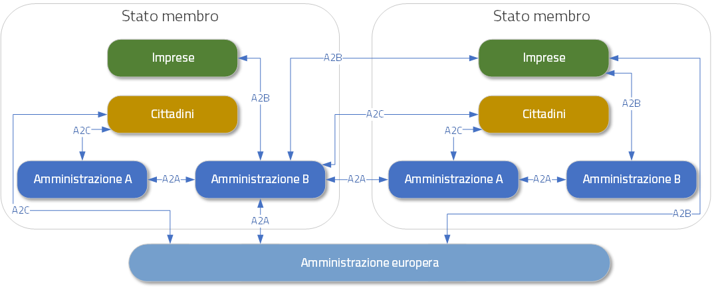
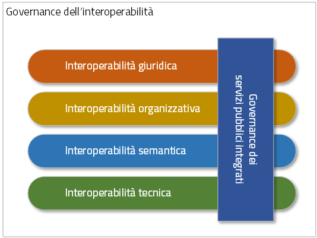
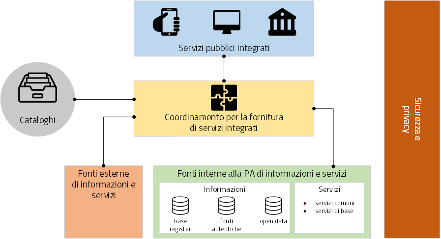

Il contesto europeo
===================

Lo *European Interoperability Framework (EIF)* (in italiano Quadro Europeo di Interoperabilità - QEI [4]_) fornisce orientamenti alle PA Europee su come operare le iniziative relative al tema dell'interoperabilità; tutto questo mediante una serie di raccomandazioni atte a stabilire relazioni tra le varie organizzazioni, razionalizzare i processi volti a sostenere i servizi digitali e assicurare che le norme esistenti e quelle nuove non pregiudichino gli sforzi di interoperabilità.

L'obiettivo dell'EIF è:

-   orientare gli sforzi delle PA Europee nel progettare ed erogare servizi pubblici ad altre PA, cittadini e imprese che siano, per quanto possibile, *(i)* digitali per definizione, *(ii)* transfrontalieri per definizione e *(iii)* aperti per definizione; 

-   fornire alle PA orientamenti in merito alla progettazione e all'aggiornamento di quadri nazionali di interoperabilità o di politiche nazionali, strategie e orientamenti che promuovano l'interoperabilità;

-   contribuire all'istituzione del Digital Single Market incoraggiando l'interoperabilità transfrontaliera e intersettoriale per l'erogazione di servizi pubblici europei.

*Figura 1 - Ambito di applicazione dell'EIF*

L'ambito di applicazione dell'EIF comprende tre tipi di interazioni:

-   A2A (*amministrazione-amministrazione*), ossia le interazioni tra PA;

-   A2B (*amministrazione-impresa*), ossia le interazioni tra le PA e le imprese;

-   A2C (*amministrazione-cittadino*), ossia le comunicazioni tra le PA e i cittadini.

Il modello di interoperabilità delineato nell'EIF è applicabile a tutti i servizi pubblici digitali, lo stesso include:

-   quattro livelli di interoperabilità:

    -   giuridico, per garantire che le organizzazioni che operano nell'ambito di diversi quadri giuridici (nazionali e settoriali), possano lavorare insieme;

    -   organizzativo, per favorire l'allineamento delle procedure e processi delle organizzazioni coinvolte delineando le responsabilità e le aspettative per raggiungere obiettivi comuni concordati e reciprocamente vantaggiosi;

    -   semantico, per assicurare che il formato e il significato delle informazioni e dei dati scambiati siano mantenuti e compresi durante tutti gli scambi che avvengono tra le parti;

    -   tecnico, in cui, attraverso l'adozione di specifiche di interfaccia, di servizi di interconnessione, di servizi di integrazione dei dati, la presentazione e lo scambio dei dati e i protocolli di comunicazione sicuri, si assicuri l'interoperabilità delle applicazioni e delle infrastrutture che collegano sistemi e servizi.

-   una componente trasversale ai quattro livelli, denominata *governance dei servizi pubblici integrati*, per assicurare il necessario coordinamento e governance delle organizzazioni coinvolte nella erogazione di servizi pubblici in modo integrato;

-   un livello di base, denominato *governance di interoperabilità*, per assicurare che le decisioni prese in merito ai quadri di interoperabilità, disposizioni istituzionali, strutture organizzative, ruoli e responsabilità, politiche, accordi e altri aspetti garantiscano e verifichino l'interoperabilità a livello nazionale e di UE.

*Figura 2 - Livelli di interoperabilità*

Nel suo insieme il modello di interoperabilità delineato nell'EIF è stato disegnato sulla base dei 12 principi di interoperabilità, condivisi dagli Stati membri della Comunità Europea, individuati quali aspetti fondamentali per guidare le azioni tese a garantire l'interoperabilità:

1.  *Sussidiarietà e proporzionalità*. Il principio di sussidiarietà prevede che le decisioni dell'UE vengano prese al livello più vicino a quello del cittadino mentre il principio di proporzionalità limita l'azione dell'UE a quanto necessario per raggiungere gli obiettivi dei trattati.

2.  *Apertura*. Il principio di apertura fa riferimento principalmente ai dati, alle specifiche e al software. Nell'ottica di questo principio occorre: pubblicare i dati che si possiedono come dati aperti, fatta salva l\'eventuale applicazione di determinate restrizioni; garantire condizioni di parità per il software open source e prenderne in considerazione l\'utilizzo in modo attivo ed equo, tenendo conto del costo totale di proprietà della soluzione; prediligere le specifiche aperte, tenendo debitamente conto delle esigenze funzionali, del livello di maturità e del sostegno e dell\'innovazione del mercato.

3.  *Trasparenza*. In ottemperanza a questo principio occorre: conferire visibilità nel contesto amministrativo di una PA; assicurare la disponibilità di interfacce con i sistemi informatici interni e  garantire il diritto alla tutela dei dati personali; garantire visibilità interna e fornire interfacce esterne per i servizi pubblici.

4.  *Riusabilità*. Secondo tale principio si deve trarre vantaggio dal lavoro degli altri cercando le informazioni disponibili, valutandone l'utilità o la pertinenza rispetto al problema in questione e, se del caso, decidendo di usare soluzioni che si sono rivelate efficaci in altre situazioni.

5.  *Neutralità tecnologica e portabilità dei dati*. Allorché istituiscono servizi pubblici, le PA devono concentrarsi sulle esigenze funzionali e posporre le decisioni in materia di tecnologia il più a lungo possibile per ridurre al minimo la dipendenza tecnologica, evitare di imporre tecnologie o prodotti specifici ai loro partner ed essere in grado di adattarsi all'ambiente tecnologico in rapida evoluzione.

6.  *Centralità dell'utente*. Nel determinare quali servizi pubblici erogare e come farlo, si deve prendere in considerazione le esigenze degli utenti. Occorre perciò mettere a punto meccanismi per coinvolgere gli utenti nell\'analisi, nella progettazione, nella valutazione e nell\'ulteriore sviluppo dei servizi pubblici

7.  *Inclusione e accessibilità*. Inclusione significa permettere a chiunque di approfittare delle opportunità offerte dalle nuove tecnologie per l'accesso e l'utilizzo dei servizi pubblici europei superando gli svantaggi e l'esclusione sociale ed economica. L'accessibilità garantisce che le persone anziane, i disabili e gli altri gruppi svantaggiati possano utilizzare i servizi pubblici alla stregua di tutti gli altri cittadini.

8.  *Sicurezza e privacy*. Le interazioni con le autorità pubbliche devono svolgersi in un ambiente sicuro ed affidabile ed in totale conformità con le norme in materia di protezione dei dati, di identificazione elettronica e dei servizi fiduciari.

9.  *Multilinguismo*. Occorre soddisfare le aspettative di cittadini e imprese che desiderano essere serviti nella loro lingua, o in un'altra lingua di preferenza, e la capacità delle PA di offrire servizi in tutte le lingue ufficiali.

10. *Semplificazione Amministrativa*. Le PA, laddove possibile, devono razionalizzare e semplificare le loro procedure amministrative migliorandole o eliminando quelle che non hanno utilità pubblica.

11. *Conservazione delle informazioni*. La legislazione impone che le decisioni e i dati siano conservati e che vi si possa accedere per un determinato periodo di tempo. Occorre pertanto formulare una politica di conservazione a lungo termine per le informazioni relative ai servizi pubblici.

12. *Valutazione dell'efficacia e dell'efficienza*. Esistono numerosi modi per misurare il valore offerto dall'interoperabilità dei servizi pubblici, quali le considerazioni circa il ritorno sull'investimento, il costo totale di proprietà, il livello di flessibilità e adattabilità, la riduzione degli oneri amministrativi, l'efficienza, la riduzione dei rischi, la trasparenza, la semplificazione, il miglioramento dei metodi di lavoro e il grado di soddisfazione degli utenti. Valutare l\'efficacia e l\'efficienza di diverse soluzioni di interoperabilità e opzioni tecnologiche, in considerazione delle esigenze dell\'utente, della proporzionalità e dell\'equilibrio tra costi e benefici.

L'EIF delinea uno schema concettuale per i servizi pubblici integrati al fine di orientarne la progettazione, lo sviluppo, la gestione e la manutenzione da parte degli Stati membri. Lo schema concettuale promuove l'idea di *interoperability-by-design* (*interoperabilità fin dalla fase di progettazione*). Lo schema promuove la riusabilità come motore per l'interoperabilità, riconoscendo che i servizi pubblici dovrebbero riutilizzare le informazioni e i servizi esistenti e provenienti da varie fonti, sia all'interno che all'esterno dei confini organizzativi delle PA. Le informazioni e i servizi dovrebbero essere recuperabili e resi disponibili in formati interoperabili.

*Figura 3 - Schema concettuale per i servizi pubblici integrati*

La Commissione Europea ha individuato uno schema concettuale per i servizi pubblici che comprende:

-   la *fornitura di servizi integrati* basata su una *funzione di coordinamento* per eliminare la complessità per l'utente finale;

-   una politica di fornitura del servizio basata sul *concetto secondo cui tutte le porte sono buone* per offrire opzioni e canali alternativi per l'erogazione dei servizi, garantendo nel contempo la disponibilità di canali digitali (*digital first*);

-   il riutilizzo di dati e servizi per ridurre i costi e accrescere la qualità dei servizi e l'interoperabilità;

-   cataloghi che descrivono i servizi riutilizzabili e le altre risorse per aumentare la loro rintracciabilità e il loro utilizzo;

-   la governance dei servizi pubblici integrati;

-   la sicurezza e la tutela della privacy.

La funzione di coordinamento garantisce l'individuazione delle esigenze e il ricorso ai servizi coordinati per fornire complessivamente un servizio pubblico. Le fonti di informazioni (*base register*, portali sui dati aperti e altre fonti autorevoli di informazioni) e i servizi, disponibili non solo all'interno del sistema amministrativo ma anche in un contesto esterno, possono essere utilizzati per creare servizi pubblici integrati. Per favorire questi processi occorre sviluppare un\'infrastruttura condivisa di servizi e fonti di informazioni riutilizzabili che possa essere adottata da tutte le amministrazioni pubbliche favorendo il riutilizzo, la pubblicazione e l'aggregazione dei servizi e delle fonti di informazioni.

La direttiva relativa al riutilizzo dell'informazione del settore pubblico prevede un quadro giuridico comune per il riutilizzo dei dati (*open data*); in essa l'accento è posto sulla messa a disposizione di dati *machine-readable* ad uso di terzi per promuovere la trasparenza, la concorrenza leale, l'innovazione e un'economia basata sui dati.

I *cataloghi* hanno la finalità di consentire la ricerca di servizi, dati, software e modelli di dati.

Le PA devono poter fruire dei servizi erogati da terzi al di fuori dei confini delle loro organizzazioni, quali i servizi di pagamento forniti dalle istituzioni finanziarie oppure i servizi di connettività erogati
da fornitori di servizi di telecomunicazioni. Esse hanno bisogno anche di utilizzare le *fonti esterne di informazioni*, quali i dati aperti e i dati delle organizzazioni internazionali, delle camere di commercio,
ecc.

Nell'EIF è raccomandato:

-   rendere disponibili fonti autorevoli di informazioni a terzi, istituendo nel contempo meccanismi di accesso e controllo per garantire la sicurezza e la riservatezza in conformità con la normativa specifica in materia;

-   sviluppare interfacce con i base register, pubblicare i mezzi tecnici e i documenti necessari affinché terze parti possano connettersi e riutilizzare le informazioni disponibili;

-   abbinare ad ogni base register i metadati appropriati, compresi la descrizione del contenuto, la garanzia del servizio e le responsabilità, le tipologie di master data contenuti, le condizioni di accesso e le licenze, la terminologia, il glossario e le informazioni sugli eventuali master data utilizzati di altri base register;

-   creare e monitorare piani di garanzia della qualità dei dati per i base register e i relativi master data;

-   elaborare cataloghi di servizi pubblici, dati pubblici e soluzioni di interoperabilità e utilizzare modelli comuni per descriverli;

-   adottare e riusare fonti di informazioni e servizi esterni, laddove utile e fattibile, nello sviluppo dei servizi pubblici.

La sicurezza e privacy sono aspetti che devono essere definiti in pieno accordo con l\'`e-Government action plan 2016-2020 della Commissione EU https://ec.europa.eu/digital-single-market/en/news/communication-eu-egovernment-action-plan-2016-2020-accelerating-digital-transformation>`__ [5]_. Per le PA è raccomandato:

-   tenendo conto dei requisiti specifici di sicurezza e riservatezza, identificare per ogni servizio le contromisure in conformità con piani di gestione del rischio;

-   utilizzare i servizi fiduciari, in base al regolamento in materia di identificazione elettronica e servizi fiduciari, come meccanismi per garantire lo scambio sicuro e protetto dei dati nei servizi pubblici (`Regolamento (UE) 2014/910 <http://eur-lex.europa.eu/legal-content/IT/TXT/HTML/?uri=CELEX%3A32014R0910&from=EN>`__ [6]_).

Per perseguire gli obiettivi dell'EIF, la Commissione Europea ha individuato i seguenti obblighi per gli stati membri.

-   Le PA devono identificare, negoziare e approvare un approccio comune per i componenti di servizi integrati. Ciò è realizzato a diversi livelli amministrativi, in base all'assetto organizzativo di ogni paese, per garantire che piani nazionali e le strategie di interoperabilità siano allineati con l'EIF e, se necessario, adattati e ampliati per tenere conto del contesto e delle esigenze nazionali.

-   L'accesso ai servizi e alle informazioni deve essere realizzato mediante specifiche interfacce e condizioni di accesso preventivamente definite (accordi di interoperabilità). Vanno favorite le politiche di riuso dei dati e dei servizi.

-   Concordare uno schema comune per interconnettere i componenti dei servizi, nonché predisporre e mantenere l\'infrastruttura necessaria per istituire e mantenere i servizi pubblici europei.

-   Le PA devono documentare i propri processi lavorativi utilizzando tecniche di modellizzazione comunemente accettate per erogare un servizio pubblico.

-   Percepire i dati e le informazioni come un bene pubblico che deve essere adeguatamente prodotto, raccolto, gestito, condiviso, protetto e preservato, elaborando una strategia di gestione delle informazioni al livello più alto possibile per evitare la frammentazione e la duplicazione.

-   Promuovere l\'istituzione di comunità di settore e intersettoriali che mirino a creare specifiche aperte sulle informazioni condividendo i propri risultati sulle piattaforme nazionali ed europee.

-   Utilizzare specifiche aperte, per garantire l\'interoperabilità tecnica quando si istituiscono servizi pubblici.

.. discourse::
	:topic_identifier: 0000

	
.. [4] In precedenti documenti a cura di AgID e del Team Digitale, il termine inglese framework è stato sovente tradotto in italiano come modello, ed è questo il termine utilizzato nel presente documento. La dicitura *quadro* è la traduzione letterale della Commissione Europea. Nel seguito di questo documento verrà preferito il termine modello, pur considerando i termini framework, modello e quadro come sinonimi.

.. [5] Cf. `https://ec.europa.eu/digital-single-market/en/news/communication-eu-egovernment-action-plan-2016-2020-accelerating-digital-transformation <https://ec.europa.eu/digital-single-market/en/news/communication-eu-egovernment-action-plan-2016-2020-accelerating-digital-transformation>`__ 

.. [6] Cf. `http://eur-lex.europa.eu/legal-content/IT/TXT/HTML/?uri=CELEX%3A32014R0910&from=EN <http://eur-lex.europa.eu/legal-content/IT/TXT/HTML/?uri=CELEX%3A32014R0910&from=EN>`__

