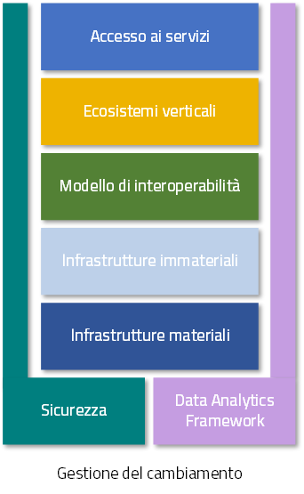

Il quadro di riferimento attuale
================================

Il `Piano triennale per l'informatica nella PA <https://pianotriennale-ict.italia.it/>`__ [7]_ costituisce il quadro di riferimento entro cui si colloca il ModI all'interno del *Modello strategico di evoluzione del sistema informativo della PA*.

*Figura 4 - Piano triennale per l'informatica nella PA*

Il modello strategico, pensato per superare l'approccio a "silos", storicamente adottato dalla PA, mira a favorire la realizzazione di un sistema informativo unitario della PA ed è caratterizzato da:

1.  Gli strumenti per la generazione e diffusione dei servizi digitali, indicati come **Accesso ai servizi**, che:

    1.  definiscono regole comuni per la progettazione di interfacce, servizi e contenuti, migliorando e rendendo coerente la navigazione e l'esperienza del cittadino e delle imprese;

    2. facilitano il design, la realizzazione e la diffusione di servizi digitali;

    3. definiscono linee guida e kit di sviluppo;

    4. provvedono alla creazione di community di sviluppatori, di designer e di chiunque voglia scambiare informazioni, collaborare e partecipare.

2.  Gli **Ecosistemi**, sono i settori o le aree omogenee in cui si svolge l'azione da parte delle PA. Ciascun ecosistema coinvolge enti e organismi pubblici, e soggetti privati che operano nella stessa  area di interesse e che a vario titolo svolgono funzioni attive all'interno dell'ecosistema stesso. I soggetti interessati interagiscono per il raggiungimento di obiettivi comuni attraverso 

    1.  la condivisione delle esigenze e delle modalità operative;

    2. la condivisione delle differenti competenze;

    3. la pianificazione e la realizzazione di progetti ICT.

3.  Il **Modello di Interoperabilità,** definisce i meccanismi che facilitano e garantiscono la corretta interazione tra gli attori del sistema (cittadini, imprese e PA), favorendo la condivisione trasparente di dati, informazioni, piattaforme e servizi. Il Modello di Interoperabilità è costituito da linee guida, standard tecnologici e profili di interoperabilità che ciascuna PA dovrà seguire al fine di garantire l'interoperabilità dei propri sistemi con quelli di altri soggetti per l'implementazione complessiva del Sistema informativo della PA.

4.  Le **Infrastrutture immateriali** e il **Data & Analytics Framework** (DAF) della PA, che incentivano la centralizzazione e la razionalizzazione dei sistemi per la gestione dei processi e dei dati, riducendo la frammentazione degli interventi. In particolare, le *Infrastrutture immateriali* facilitano, standardizzano e razionalizzano la creazione di servizi ICT e sono composte dalle Piattaforme abilitanti e dai Dati della PA:
	
	1. nelle *piattaforme abilitanti* ricadono tutti quei servizi infrastrutturali (eg. servizio di identificazione, servizio di pagamenti, ANPR) che agevolano e riducono i costi per la realizzazione di nuovi servizi uniformando gli strumenti utilizzati dagli utenti finali durante la loro interazione con la PA;

	2. relativamente ai *dati della PA* si distinguono: le basi di dati di interesse nazionale, gli open data, e i vocabolari controllati.

	Il *Data & Analytics Framework* è un ambiente centralizzato che	acquisisce e rende più fruibili i dati pubblici di interesse e ha l'obiettivo *(i)* di rendere più semplice e meno onerosa l'interoperabilità dei dati pubblici tra PA e la distribuzione e standardizzazione dei dati aperti (open data) e *(ii)* di permettere lo studio dei fenomeni sottostanti ai dati pubblici.
	
5.  Le **Infrastrutture fisiche,** che perseguono l'obiettivo di aumentare la sicurezza, ridurre il costo delle infrastrutture tecnologiche e migliorare la qualità dei servizi software della PA, attraverso la razionalizzazione dei data center, l'adozione sistematica del paradigma cloud e lo sviluppo della connettività, con particolare riferimento alla rete Internet nei luoghi pubblici e negli uffici della PA.

6.  La **Sicurezza** che comprende:

    -   le attività per la regolazione e regolamentazione della cyber-security nella PA per l'*assessment test,*

    -   il CERT-PA quale strumento operativo per supportare l'adozione dei corretti livelli di sicurezza presso le PA.

7.  La **Gestione del cambiamento** che è una componente definita per far fronte alle necessità di coordinamento, gestione e monitoraggio delle attività funzionali allo sviluppo del Piano.

.. discourse::
   :topic_identifier: 3232

	
.. [7] Cf. `https://pianotriennale-ict.italia.it/ <https://pianotriennale-ict.italia.it/>`__ 
