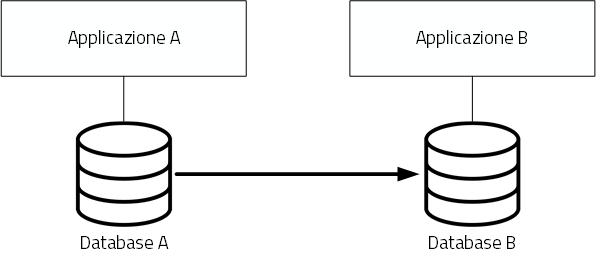
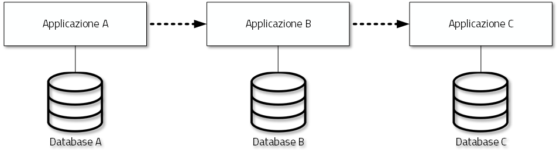
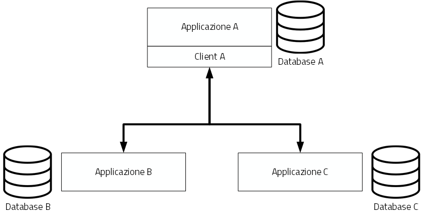

Principi del nuovo modello di interoperabilità
==============================================

Interazioni
-----------

L'ambito di applicazione del Modello di Interoperabilità 2018 comprende i tre tipi di interazioni previsti nell'EIF. Le interazioni prevedono che i soggetti coinvolti svolgano alternativamente la funzione di **erogatore** di servizio, nel caso del soggetto che mette a disposizione API o servizio utilizzati da altri, e la funzione di **fruitore**, nel caso invece del soggetto che utilizza le API o servizi messi a disposizione da altro soggetto.

.. image:: ../media/image5.png

*Figura 5 - Ambito di applicazione del modello di interoperabilità*

I soggetti fruitori possono utilizzare le API/servizi [10]_ esposti dall'erogatore attraverso:

-   una soluzione software attivata da un attore umano (*user agent/human*);

-   un sistema applicativo *automatico* [11]_ (*server/machine*), anche allo scopo di definire nuovi servizi a valore aggiunto.

In considerazione di quanto sopra si individuano le seguenti possibili interazioni:

1.  A2A in modalità *human-to-machine*;

2.  A2A in modalità *machine-to-machine*;

3.  A2B in modalità *human-to-machine*;

4.  A2B in modalità *machine-to-machine*;

5.  A2C in modalità *human-to-machine*.

Paradigmi di cooperazione
-------------------------

In generale, nell'integrazione dei sistemi software si individuano principalmente le seguenti tre casistiche che il modello di interoperabilità deve tener presente:

-   **Condivisione di dati**: l\'obiettivo è quello di tenere allineati i dati di uno o più sistemi; le applicazioni software che gestiscono (creano, aggiornano, leggono ed eventualmente cancellano [12]_) tali dati, sono logicamente e fisicamente indipendenti. I processi che sovraintendono le applicazioni sono separati ed indipendenti. Il caso tipico è quello di un'Amministrazione, o soggetto privato, che per dare seguito ad una sua attività ha necessità di accesso ai dati posseduti dall'Amministrazione B, titolare degli stessi, senza che sia richiesto all'Amministrazione B nessuna elaborazione sui dati. Ad esempio, B è il Ministero delle Finanze che ha i dati del codice fiscale di ogni cittadino, ed A è un qualsiasi altro soggetto (pubblico o privato) che all'interno della propria applicazione ha necessità di verificare la correttezza dei codici fiscali del proprio database, per poi utilizzarli in proprie elaborazioni.

-   **Notifica inter-PA**: in questo caso un'applicazione in un soggetto scatena un evento compie un'operazione che deve essere propagata sincronizzata con altre applicazioni di altri soggetti. Le applicazioni sono fisicamente indipendenti ma non logicamente, in quanto esiste un processo inter-organizzativo che sovraintende a tutte le organizzazioni che devono cooperare [13]_. Il caso tipico è quello in cui il presentarsi di un evento all'interno di un'Amministrazione A debba essere comunicato ad altri soggetti B e C, pubblici e privati, che devono dare seguito a proprie procedure interne in relazione all'evento stesso, per vincoli normativi, ecc. Ad esempio, la registrazione di una nascita in un Comune è un evento che deve essere propagato all'Agenzia delle Entrate, per il rilascio di un nuovo codice fiscale, all'AUSL di riferimento per l'iscrizione al Servizio Sanitario Nazionale, ecc.

-   **Composizione inter-PA**: in questo caso un insieme di applicazioni comunicano, anche in maniera bidirezionale, al fine di comporre una nuova logica applicativa ottenuta dalla loro interazione, ed erogare questa a sua volta come servizio a valore aggiunto. Talvolta questa nuova logica viene indicata come servizio/applicazione composito/a (o composto/a). Come nel caso precedente, esiste un processo inter-organizzativo che sovraintende a tutte le organizzazioni che vengono composte. Il caso tipico, nel mondo commerciale, è quello di un servizio che definite delle date ed una destinazione, propone all'utente voli aerei, hotel e noleggio auto, ecc, andando appunto a comporre servizi per la bigliettazione aerea, prenotazione alberghiera, noleggio auto, ecc. Nel caso della PA, un caso è una conferenza di servizi telematica [14]_ in cui diverse Amministrazioni compongono un nuovo servizio per dare seguito ad una istanza di un cittadino o di un'impresa.

È importante analizzare le analogie e differenze con il caso precedente: nel caso della notifica inter-PA, c'è una relazione peer-to-peer tra i vari soggetti coinvolti, e si parla di *coreografia* tra le applicazioni coinvolte [15]_. Nel caso invece della composizione, una delle applicazioni ha un ruolo di *orchestrazione* nei confronti delle altre, e quindi c'è una relazione uno (l'orchestratore, che fa da *master*) a molti (le applicazioni
orchestrate, che sono *slave*).

In entrambe le situazioni, esiste a livello concettuale (dovuto a norme, accordi, ecc.) un processo inter-organizzativo che sovraintende alle varie applicazioni, e l'espletamento del quale è l'obiettivo del servizio composto offerto.

La differenza tra i due casi risiede quindi nel grado di autonomia che i soggetti che concorrono al processo inter-organizzativo mantengono: se si sceglie un approccio completamente decentralizzato, si è nel caso notifica inter-PA, se si opta per un approccio per cui uno dei soggetti prende in carico la fornitura del servizio finale composto a valore aggiunto, allora si è nel caso composizione inter-PA.

Incrementalità del modello
--------------------------

In base alle considerazioni precedenti, il Modello di Interoperabilità si concretizza nella definizione, lo sviluppo, il miglioramento, la resa operativa, il mantenimento e la promozione di servizi, strumenti, norme tecniche e specifiche per l'interoperabilità delle soluzioni ICT basata su un'architettura modulare che include componenti interconnessi con l'ausilio di infrastrutture comuni. Questo modello, al fine di evitare le problematiche di possibile obsolescenza, e fronteggiare la necessità di continui aggiornamenti, si estrinsecherà concretamente in rilasci successivi e cadenzati nel tempo, di una serie di 5 documenti, in particolare:

1. **Presentazione del Modello di Interoperabilità 2018**, che è il documento attuale, rilasciato nella prima versione a maggio 2018.

2. **Tecnologie ed approcci all'Integrazione ed Interoperabilità**, che nella prima versione (maggio 2018) viene rilasciato contestualmente al presente documento. Ha come oggetto l\'individuazione delle possibili tecnologie ed approcci che possono essere utilizzati dalle PA.

3. **Pattern e Profili di Interoperabilità**, che fornirà indicazioni concrete, a livello tecnico, su differenti modalità operative per realizzare l'interoperabilità, tenendo conto delle possibili tecnologie ed approcci disponibili. La prima release di questo documento è prevista per l'estate 2018. Il Modello introduce il concetto di profilo di interoperabilità e come esso possa essere evoluto nel tempo; si introduce anche il concetto di pattern di interoperabilità. Infine questo documento si occuperà di discutere anche l'aspetto della QoS - Quality of Service e degli SLA - Service Level Agreement.

4. **Governance del Modello di Interoperabilità**, che presenterà compiutamente la governance dell'intero modello e le sue modalità di evoluzione, ed è previsto in una prima versione per l'estate 2018.

5. **Registri e Cataloghi**, che si occuperà di definire le linee guida per i registri e cataloghi necessari a supportare il modello stesso. Anche per questo documento è prevista una prima versione per l'estate 2018.

Gli interventi mirano, in coordinamento con le altre azioni presenti nel Piano Triennale per l'Informatica nella PA, a:

-   definire e attuare specifiche comuni sui termini e le condizioni per gestire e accedere ai *base register*;

-   attuare e promuovere modelli comuni per descrivere e classificare i servizi pubblici;

-   individuare misure volte a creare sicurezza, tracciabilità e SLA - Service Level Agreement nell'erogazione dei servizi;

-   analizzare i dati contenuti e i sistemi esistenti per l'informatizzazione delle PA;

-   individuare gli ostacoli al reciproco riconoscimento, sviluppare mappature e sostenere gli sforzi di armonizzazione.

Gli **standard tecnologici** adottati, in particolare per i web service REST e SOAP, rispecchiano l'attuale stato di evoluzione delle tecnologie ed il loro utilizzo è consolidato nelle pratiche adottate nell'ambito
dell'interoperabilità dei sistemi informativi.

Profili e pattern di interoperabilità
-------------------------------------

Il nuovo modello introduce i concetti di **caso d'uso**, **pattern** e **profilo di interoperabilità**.

Un caso d'uso di interoperabilità è la formalizzazione di una specifica esigenza di interoperabilità, che si manifesta frequentemente tra PA, o che può manifestarsi in particolari contesti applicativi. Tale necessità
viene descritta mostrandone il contesto di applicazione, i problemi progettuali che ne derivano, i possibili schemi di soluzione e le implicazioni di ognuno di essi.

Ogni caso d'uso può essere risolto in vari modi, ognuno di questi schemi verrà indicato come pattern di interoperabilità. Esso fornisce una serie di linee guida per l\'implementazione e l\'interoperabilità che raccomandano come utilizzare una specifica tecnologia od approccio, e permette eventualmente di risolvere eventuali ambiguità/punti non adeguamente definiti in alcune tecnologie possibili con cui le PA possono interoperare.

Un profilo infine, in maniera trasversale rispetto ai casi d'uso ed ai pattern, risolve le diverse opzionalità o aspetti non adeguatamente specificati dagli standard tecnologici.

L'applicazione dei casi d'uso, pattern e profili agevola l'azione nello sviluppo e nella distribuzione di API/servizi. Il nuovo Modello proporrà un catalogo *di casi d'uso*, *profili* e *pattern* *di interoperabilità* messi a disposizione delle PA, popolato in maniera incrementale sulla base di esigenze individuate dall'Agenzia per l'Italia Digitale anche a fronte dell'evidenza di nuovi bisogni per le PA.

Ogni PA che offre un'API/servizio deve, nel nuovo modello, offrire un insieme di artefatti che lo accompagnano, in particolare:

-   meccanismi di controllo delle versioni;

-   documentazione coordinata alla versione;

-   Software Development Kit - SDK - per l'interfacciamento e un ambiente di test (in analogia a quanto avviene per alcuni servizi commerciali di largo utilizzo in applicazioni Web [16]_);

-   dichiarazione sulla qualità del servizio che si impegna a rispettare. In questo secondo caso, deve anche definire le modalità di misurazione e deve offrire un'opportuna modalità di monitoraggio, che i fruitori possono sfruttare per la verifica.

Nello scambio informativo tra PA mediante API/servizi, le soluzioni che verranno adottate devono assicurare: *(i)* autenticità, *(ii)* integrità e *(iii)* non ripudio. In questo contesto il Regolamento (UE) 2014/910
fornisce una base normativa comune per le interazioni elettroniche sicure fra cittadini, imprese e PA; le soluzioni software conformi al Modello di Interoperabilità devono applicare i principi indicati in esso.

Catalogo delle API/servizi
--------------------------

Il Modello di Interoperabilità prevede la presenza del *Catalogo* quale componente che assicura alle parti coinvolte nel rapporto erogazione/fruizione la consapevolezza sulle interfacce e i livelli di servizio dichiarati.

La presenza del Catalogo è funzionale a:

-   facilitare l'interoperabilità tra le PA e tra queste e i soggetti privati interessati;

-   contenere la spesa della PA riducendo la replicazione di API/servizi;

-   manifestare gli impegni dei fornitori o erogatori di API/servizi.

La realizzazione del Catalogo deve, fatti salvi i principi comuni che saranno emanati dall'Agenzia per l'Italia Digitale al fine di permettere una normalizzazione a livello nazionale, tener conto della:

-   specificità dei territori e dei diversi ambiti entro cui la PA opera che potrà determinare la specializzazione del catalogo, prevedendo contenuti con un livello di aggregazione territoriale (eg. su base regionale) e/o relativamente agli ambiti tematici entro cui opera la PA (eg. giustizia). Tale scelta è ulteriormente giustificata dalla opportunità di favorire momenti di aggregazione di soggetti omogenei.

-   esigenza di assicurare la governance del Catalogo, quale presupposto per garantire una semantica univoca e condivisa, per evitare ridondanze e/o sovrapposizioni in termini di competenze e contenuti.

-   esigenza di assicurare una descrizione formale delle API/servizi che, attraverso l'utilizzo di *interface description language*, permetta di descrivere le interfacce degli stessi in maniera indipendente dal linguaggio di programmazione adottato dall'erogatore e dai fruitori degli stessi. L'attuale stato di evoluzione degli standard tecnologici indicati in precedenza determina la scelta di *WSDL* per i *web service SOAP* e *OpenAPI v3* per i *web service REST.*

Governance del modello
----------------------

L'Agenzia per l'Italia Digitale è responsabile delle attività di *governance* del ModI 2018 con l'obiettivo di definire, condividere ed assicurare l'aggiornamento continuo dei seguenti aspetti:

-   l'*insieme delle tecnologie* che abilitano l'interoperabilità tra le PA, e tra queste e cittadini ed imprese;

-   i *casi d'uso di interoperabilità*;

-   i *pattern di interoperabilità*;

-   i *profili di interoperabilità*;

-   il *catalogo* dei servizi resi disponibili dalle PA.

I progetti che realizzano gli Ecosistemi, previsti nel Piano Triennale per l'Informatica nella PA, si basano sul Modello di Interoperabilità, e possono determinare l'esigenza di nuovi *casi d'uso*, *pattern* e *profili di interoperabilità* che verranno definiti con un approccio collaborativo.

Nel precedente SPCoop, l\'uso di servizi/API richiedeva un accordo tra amministrazioni anche tramite la firma di convenzioni bilaterali. Questo non sarà più necessario nel nuovo modello, in cui l'adesione si estrinsecherà nell'atto di registrazione da parte della PA di un'API/servizio nel catalogo. In ottemperanza al principio \"once-only\" definito nell\'`EU eGovernment Action Plan 2016-2020 <https://ec.europa.eu/digital-single-market/en/news/communication-eu-egovernment-action-plan-2016-2020-accelerating-digital-transformation)>`__ [17]_, l\'erogatore si impegna a fornire l\'accesso alle proprie API/servizi a qualunque soggetto registrato ne faccia richiesta [18]_. Gli erogatori devono descrivere le loro API/servizi classificando le informazioni scambiate ove possibile collegandole ai vocabolari controllati e a concetti semantici predefiniti, utili anche a determinare l'impatto rispetto ai regolamenti in tema privacy e GDPR, e applicando tag di categoria. Il Catalogo può facilitare questo processo attraverso opportune euristiche.

In virtù degli articoli 12 e 14 del Codice dell\'Amministrazione Digitale, AgID è formalmente incaricata della gestione di tutto il catalogo e di garantire il rispetto delle regole suddette e per farlo si avvale della collaborazione di alcuni enti, che vengono indicati come Capofila.

Gli enti Capofila si proporranno per eseguire questo compito su porzioni del catalogo; ci saranno enti che si occupano della gestione di aree geografiche e, allo stesso tempo, enti che si occupano della gestione di
particolari aree tematiche.

In prima istanza si prevede che gli enti Capofila possano essere:

-   a livello territoriale, le Regioni (e.g., la Regione per conto delle ASL regionali)

-   a livello di ecosistema, gli enti individuati dai GdL descritti nel Piano Triennale al capitolo 6 Ecosistemi.

A tal fine, sul fronte delle aree tematiche il Piano Triennale 2017-2019 introduce:

-   gli `Ecosistemi <http://pianotriennale-ict.readthedocs.io/it/latest/doc/06_ecosistemi.html>`__ [19]_, settori o aree di intervento in cui si svolge l'azione delle PA, che raggruppano i vari enti per aree tematiche;

-   i `Gruppi di Lavoro <http://pianotriennale-ict.readthedocs.io/it/latest/doc/06_ecosistemi.html#linee-di-azione>`__ [20]_ che, all\'interno degli Ecosistemi, indirizzano il vero e proprio lavoro di standardizzazione coinvolgendo sia tecnici che esperti dei rispettivi domini applicativi.

I Gruppi di Lavoro devono formalizzare le specifiche di dettaglio, attraverso il meccanismo dei profili e dei pattern di interoperabilità, e revisionare periodicamente le specifiche rilasciate.

Il nuovo Modello opera in assenza di elementi centralizzati che mediano l'interazione tra le entità comunicanti (erogatore e fruitore del servizio), pur prevedendo la presenza di un catalogo dei servizi disponibili allo scopo di permettere a tutti i soggetti interessati, pubblici e privati, di acquisire conoscenza dei servizi disponibili e delle loro modalità di erogazione/fruizione.

L'Agenzia per l'Italia Digitale ha il ruolo di:

-   recepire le esigenze, anche applicative, delle PA, astrarre tali esigenze ed eventualmente formalizzare i casi d'uso ed i pattern di interoperabilità;

-   coordinare il processo di definizione dei profili di interoperabilità;

-   rendere disponibile il catalogo, attraverso un'interfaccia di accesso unica per permettere a tutti i soggetti interessati, pubblici e privati, di assumere consapevolezza dei servizi disponibili;

-   verificare il rispetto delle regole del Modello di Interoperabilità, quale condizione di accesso al catalogo, e controllare con continuità il rispetto dei requisiti per l'iscrizione al catalogo.

.. discourse::
   :topic_identifier: 3234

	
.. [10] Con abuso di nomenclatura, ma intuitivamente chiaro, si intende nel presente documento servizio e API come sinonimo, ad indicare una componente software, esposta sul Web, che funge da servente e può essere utilizzata da client. In modo rigoroso, sia SPCoop che il ModI 2018 prevedono l'esposizione da parte di una PA di un'API accessibile sul Web come modalità base di interoperabilità e scambio di dati/informazioni, tale API permette la fruizione di un servizio offerto dalla PA stessa. La tecnologia web service è una particolare modalità con cui realizzare API che siano accessibili su Internet/intranet, da cui il termine Web. Tali concetti verranno     ulteriormente approfonditi nel Modello di Interoperabilità 2018.

.. [11] Quindi non attivato da un utente umano, anche impropriamente detto *enterprise* in taluni contesti.

.. [12] Cf. le cosiddette operazioni CRUD - Create, Read, Update, Delete 

.. [13] Nel caso della PA, questo processo inter-organizzativo corrisponde al concetto di macro-processo o di processo inter-amministrazione: M Mecella, C Batini (2001), Enabling italian e-government through a cooperative architecture. IEEE Computer 34 (2), pp. 40-45.

.. [14] La conferenza di servizi, cf. `http://www.italiasemplice.gov.it/conferenza/guida-alle-novita-della-conferenza-di-servizi/ <http://www.italiasemplice.gov.it/conferenza/guida-alle-novita-della-conferenza-di-servizi/>`__ , è l'istituto che facilita l\'acquisizione da parte della PA di autorizzazioni, atti, licenze, permessi e nulla-osta o di altri elementi comunque denominati, finalizzati all\'emissione di un provvedimento amministrativo, coordinando differenti soggetti coinvolti. La conferenza semplificata in modalità sincrona è l'esempio di composizione di servizi, mentre la conferenza semplificata in modalità asincrona costituisce un altro caso della modalità precedente (notifica inter-PA).

.. [15] Approfondimenti sui concetti di orchestrazione e coreografia possono essere trovati in: `https://stackoverflow.com/questions/4127241/orchestration-vs-choreography <https://stackoverflow.com/questions/4127241/orchestration-vs-choreography>`__ (C Peltz (2003), Web Services Orchestration and Choreography. IEEE, Computer 36(10), pp. 46-52 e R M Dijkman, M Dumas (2004), Service-Oriented Design: A Multi-Viewpoint Approach. Int. J. Cooperative Inf. Syst. 13(4), pp. 337-368)

.. [16] Ad es., Paypal, cf. `https://developer.paypal.com/ <https://developer.paypal.com/>`__ , offre SDK ed un servizio di prova, cosiddetta sandbox, che permette agli sviluppatori che si vogliono integrare con Paypal di provare le interazioni prima di rilasciare i propri sistemi.

.. [17] Cf. EU eGovernment Action Plan 2016-2020, `https://ec.europa.eu/digital-single-market/en/news/communication-eu-egovernment-action-plan-2016-2020-accelerating-digital-transformation] <https://ec.europa.eu/digital-single-market/en/news/communication-eu-egovernment-action-plan-2016-2020-accelerating-digital-transformation)>`__

.. [18] Cf. `Codice dell\'Amministrazione Digitale Capo 1 Sez. 2 Art.
    3  http://cad.readthedocs.io/it/v2017-12-13/_rst/capo1_sezione2_art3.html <http://cad.readthedocs.io/it/v2017-12-13/_rst/capo1_sezione2_art3.html>`__

.. [19] Cf. `http://pianotriennale-ict.readthedocs.io/it/latest/doc/06\_ecosistemi.html <http://pianotriennale-ict.readthedocs.io/it/latest/doc/06_ecosistemi.html>`__

.. [20] Cf. `http://pianotriennale-ict.readthedocs.io/it/latest/doc/06\_ecosistemi.html\#linee-di-azione <http://pianotriennale-ict.readthedocs.io/it/latest/doc/06_ecosistemi.html#linee-di-azione>`__
