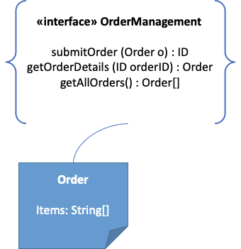
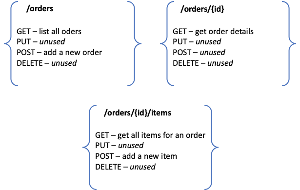

Paradigmi per la progettazione delle interfacce di servizio
==============================================================

Una trattazione completa dei paradigmi per la progettazione e
realizzazione delle interfacce di servizio esula dagli scopi del
presente documento. Il lettore interessato ad approfondire gli aspetti
metodologici può riferirsi a [1]_, [2]_ . La breve discussione che viene
presentata in questa sezione, condotta anche attraverso esempi, vuole
ricordare al lettore la problematica dell’\ *impedance mismatch* tra
differenti tecnologie per la realizzazione di interfacce di servizio ed
il modello sottostante di interfaccia (RPC-like vs. resource-oriented),
in quanto nelle schede tecniche del successivo capitolo sui profili
questi aspetti sono determinanti ai fini della comprensione del profilo
stesso.

Le interfacce di servizio, cf. la seconda sezione delle linee guida,
possono essere progettate secondo due paradigmi:

1. **RPC-like**. In questo paradigma, un’interfaccia di servizio espone
   una serie di operazioni (metodi) che permettono l’invocazione delle
   operazioni offerte dall’interfaccia. Il significato dell’operazione è
   informalmente espresso dal nome dell’operazione, dal numero e tipo
   dei suoi parametri, dal tipo del valore di ritorno (il tutto viene
   detto tecnicamente *segnatura*). Approcci formali prevedono che tale
   significato venga eventualmente anche descritto in opportuni
   documenti di accompagnamento e/o attraverso specifiche formali
   dell’interfaccia di servizio. Ogni operazione può quindi
   rappresentare sia semplici operazioni di computazione, che operazioni
   *long-running*, che operazioni di accesso a dati, ecc. Il paradigma è
   detto RPC-like in quanto le interfacce di servizio ricordano le
   librerie di chiamata a procedura (RPC sta per *remote procedure
   call*) e quindi l’interfaccia, metaforicamente, è di fatto una
   libreria di funzioni.

2. **Resource-oriented**. In questo paradigma, l’interfaccia di servizio
   offre operazioni CRUD di accesso a risorse. CRUD - Create, Read,
   Update e Delete sono le 4 operazioni fondamentali con cui manipolare
   risorse. Una risorsa è un qualsiasi oggetto informativo che possiede
   uno stato. In questo paradigma, l’interfaccia di servizio,
   metaforicamente, è un accesso diretto ad una base informativa, e le
   uniche operazioni possibili sono appunto le modifiche a tali risorse.

Parallelamente, esistono delle tecnologie con cui poter naturalmente
realizzare interfacce di servizio, che sono *(i)* SOAP ed il cosiddetto
stack WS-\* [1]_, e *(ii)* lo stile architetturale REST basato su HTTP.
Entrambe sono indicate come modi per realizzare i cosiddetti *Web
service* (servizi richiamabili sul Web).

-  Un Web service basato su SOAP espone un insieme di metodi
   richiamabili da remoto da parte di un client. SOAP definisce una
   struttura dati per lo scambio di messaggi tra applicazioni,
   codificata in XML; di fatto SOAP utilizza HTTP come protocollo di
   trasporto, ma non è limitato nè vincolato ad esso, dal momento che
   può benissimo usare altri protocolli di trasporto.

-  Un Web service RESTful adotta il modello basato su risorse secondo le
   seguenti caratteristiche:

   -  individuazione delle risorse mediante il formalismo delle URI;

   -  operazioni sulle risorse effettuate sulla rappresentazione del
      loro stato;

   -  CRUD sulle risorse mediante HTTP utilizzando i metodi nella
      semantica prevista dal protocollo stesso.

La prima differenza tra i due tipi di Web service è la visione del Web
come piattaforma di elaborazione che viene implicitamente proposta:
REST propone una visione del Web incentrata sul concetto di risorsa
mentre i SOAP Web service mettono in risalto il concetto di servizio.
Infatti, l’approccio dei SOAP Web service ha mutuato un’architettura
applicativa denominata SOA -- Service Oriented Architecture, a cui si
è contrapposta l’architettura ROA -- Resource Oriented Architecture,
ispirata ai principi REST. L’approccio adottato dai Web service basati
su SOAP è derivato dalle tecnologie di interoperabilità esistenti al
di fuori del Web e basate essenzialmente su chiamate di procedura
remota, come DCOM, CORBA e RMI. In sostanza questo approccio può
essere visto come una sorta di adattamento di queste tecnologie al
Web.

L’approccio REST, invece, tende a evidenziare le caratteristiche del
Web come piattaforma leggera per l’elaborazione distribuita. Non è, in
prima istanza, necessario aggiungere nulla a quanto è già esistente
sul Web per consentire ad applicazioni remote di interagire.

I Web Service basati su SOAP prevedono lo standard WSDL, Web Service
Description Language, per definire l’interfaccia di un servizio. Questa
è un’ulteriore evidenza del tentativo di adattare al Web l’approccio
all’interoperabilità basato su chiamate remote; infatti il WSDL non è
altro che un IDL (Interface Description Language) per un componente
software; l’esistenza di WSDL favorisce l’uso di tool per creare
automaticamente client in un determinato linguaggio di programmazione.
REST non prevede esplicitamente nessuna modalità per descrivere come
interagire con una risorsa. Le operazioni sono implicite nel protocollo
HTTP. Qualcosa di analogo a WSDL è WADL, Web Application Definition
Language, un formato XML per definire risorse, operazioni ed eccezioni
previste da un Web service di tipo REST. WADL è stato sottoposto al W3C
per la standardizzazione nel 2009, ma allo stato attuale non ci sono
piani per la sua discussione ed eventuale approvazione. In realtà esso
non ha avuto un’accoglienza molto favorevole da parte delle comunità di
sviluppatori REST.

OpenAPI è un formato di descrizione per Web service REST; un file
OpenAPI consente di descrivere l'intera interfaccia (endpoint
disponibili e operazioni su ciascun endpoint, parametri di input e
output per ogni operazione, metodi di autenticazione, informazioni di
contatto, licenza, termini di utilizzo, ecc.). Le specifiche possono
essere scritte in YAML o JSON. Swagger [2]_ è un insieme di strumenti
open source che, basandosi sulle specifiche OpenAPI, permette di
supportare il progetto, costruzione e documentazione di REST Web
service.
Un Web service SOAP è adatto a realizzare sia interfacce di servizio
RPC-like che resource-oriented, mentre un Web service REST è
finalizzato a realizzare interfacce di servizio resource oriented.
Questo è dovuto al fatto che SOAP è di fatto la specifica di un
middleware, e quindi neutro rispetto al paradigma, mentre REST, in
quanto stile architetturale, è maggiormente caratterizzato. Gli esempi
successivi evidenziano l’\ *impedance mismatch* (differenza tra i
modelli realizzativi e concettuali, cf. Capitolo 3) che si origina
nelle varie casistiche partendo da una interfaccia di servizio secondo
ciascuno dei due paradigmi (RPC-like e resource oriented) e cercando
di realizzarla utilizzando le due diverse tecnologie SOAP e REST.

   
   Interfaccia di servizio usando SOAP/WSDL.

Per semplicità nell’esempio si suppone che il singolo item nell’Order sia rappresentabile con una semplice stringa (che codifica il suo codice, ad esempio) e sempre in quantità singola (per cui un Order non fa altro che aggregare differenti Items)

**Esempio 1.** Si immagini di voler realizzare un’interfaccia di
servizio resource-oriented che permette di accedere ad informazioni su
ordini e voci (oggetti acquistati, *item*) inseriti negli ordini.
Utilizzando SOAP/WSDL, si realizza un’interfaccia di servizio che offre
operazioni quali submitOrder() e getOrderDetails(), come mostrato in
Figura 3.1. L’interfaccia di servizio utilizza Order come oggetto
serializzabile (in XML) per i dettagli dell’ordine da ritornare come
tipo di ritorno nelle varie operazioni ovvero come parametro per la sua
creazione.

Utilizzando REST, l’interfaccia di servizio corrisponde a due risorse,
Order e Item ed i verbi HTTP (ovvero GET, PUT, POST e DELETE) si mappano
esattamente sulle operazioni CRUD, come mostrato in Figura 3.2.

   
   Interfaccia di servizio usando REST.

Se l’interfaccia di servizio è resource-oriented (come appunto nel caso
precedente, in cui di fatto si vuole accedere a informazioni sugli
ordini) allora l’\ *impedance mismatch* con entrambe le tecnologie è
minima.

**Esempio 2.** Si immagini di voler realizzare un’interfaccia di
servizio che permette di avviare un task di lunga durata, ad esempio una
complessa procedura computazionale. Utilizzando SOAP/WSDL, si realizza
un’interfaccia di servizio TaskManagement con operazioni startTask() e
getResult(), che ritorna un valore che codifica che il task è ancora in
esecuzione (fintanto che non è completato), oppure il risultato finale
una volta che la procedure/task sia stata completata ed il risultato è
stato prodotto. Figura 3.3 schematizza l’interfaccia di servizio.

   
   Interfacce di servizio usando SOAP/WSDL

Per realizzare una interfaccia di servizio che fornisce la stessa logica
in tecnologia REST occorre ridefinire l'interfaccia utilizzando il
paradigma a risorse. Si introducono le risorse Task e Result utilizzando
le quali è possibile implementare le stesse funzionalità. La POST serve
quindi a far partire il task.

.. code-block:: JSON

      ⇒ POST /task
      [Input data payload]

      ⇐ 202 Accepted
      Location: /task/20181231

      {
         "task": {
         "status": "pending",
         "message": "Your task has been queued for processing",
         "ping-time": "2018-12-31T19:43:37+0100"
         }
      }
      
Il codice di stato **202 Accepted** indica che l’interfaccia di servizio ha verificato l'input della richiesta e lo ha accettato, ma non è possibile fornire una risposta immediata.

Il client deve seguire il collegamento fornito nell'intestazione
Location per informarsi (con GET) sullo stato della richiesta in
sospeso.

.. code-block:: JSON

   ⇒ GET /task/20181231

   ⇐ 200 OK
   
   {
      "task": {
      "status": "processing",
      "message": "Your task is being processed",
      "ping-time": "2018-12-31T19:52:45+0100"
      }
   }
   
I client possono inviare richieste GET in qualsiasi momento per
tenere traccia dei progressi. Oltre allo stato, la risposta contiene
anche un suggerimento (nell'elemento ping-time) su quando deve essere
eseguita la successiva richiesta di polling per ridurre il traffico
di rete e il carico di servizio a causa di un polling eccessivo.

Una volta completato il lavoro, la risposta alla richiesta di polling
reindirizza il client a un'altra risorsa da cui è possibile recuperare
il risultato finale.

.. code-block:: JSON

   ⇒ GET /task/20181231
   
   ⇐ 303 See Other
   Location: /task/20181231/result

   {
      "task": {
      "status": "done",
      "message": "Your task is completed",
      }
   }

Il client può quindi seguire il collegamento trovato nell'intestazione
Location per recuperare (con GET) il risultato della computazione
completata. Il collegamento potrebbe anche essere condiviso tra diversi
client interessati a leggere l'output della richiesta POST originale.

.. code-block:: JSON

   ⇒ GET /task/20181231/result

   ⇐ 200 OK
   [Output data payload]

Questo secondo esempio mostra invece che se l’interfaccia di servizio è
orientata alle funzionalità (come appunto nell’esempio, in cui di fatto
si vogliono eseguire operazioni remote) allora l’\ *impedance mismatch*
con SOAP è minimo, e nel caso invece si voglia utilizzare REST, occorre
convertire l’interfaccia originariamente RPC-like in una resource
oriented.

Si noti infine che nell’applicazione pratica di REST si assiste al suo
uso in modalità non del tutto canoniche. Ogni deviazione rispetto alle
caratteristiche previste da REST porta alla realizzazione di
architetture ibride tra il paradigma RESTful Web service e quello dei
Web service RPC-like. In merito ai modelli ibridi che si possono
presentare, esiste una classificazione, il cosiddetto Richardson
Maturity Model [3]_ che prevede quattro livelli, da 0 a 3, in
accordo al grado di aderenza ai dettami REST. In particolare, si possono
presentare i casi seguenti:

-  Livello 0, per servizi che semplicemente usano HTTP come protocollo
   di trasporto applicativo (tunnel HTTP). In questo caso il sistema non
   ha niente del modello REST.

-  Livello 1, per i servizi che operano sulle risorse definite secondo
   la sintassi e la semantica previste per le URI, sulle quali si opera
   invocando delle operazioni (metodi) che agiscono su di esse.

-  Livello 2, per i servizi che operano su risorse definite secondo la
   sintassi e la semantica previste per le URI, sulle quali si opera
   sulla rappresentazione del loro stato per mezzo del protocollo HTTP
   usando la semantica dei metodi (verbi) come previsti dal protocollo.

-  Livello 3, come per il livello 2, con in aggiunta la possibile
   presenza di controlli ipermediali nella rappresentazione delle
   risorse.

Si anticipa che nel Capitolo 2 dedicato ai profili, si adotteranno, nel
caso dei profili non bloccanti realizzati in tecnologia REST, delle
interfacce di servizio classificabili di livello 1 del Richardson
Maturity Model.

.. toctree::
  :maxdepth: 3
  :caption: Indice dei contenuti

  paradigmi-per-la-progettazione-delle-interfacce-di-servizio/perimetro-delle-interfacce-di-servizio.rst
  paradigmi-per-la-progettazione-delle-interfacce-di-servizio/considerazioni-sulla-natura-del-fruitore.rst
  paradigmi-per-la-progettazione-delle-interfacce-di-servizio/migrazione-dei-servizi-spcoop-nel-nuovo-framework-di-interoperabilità.rst
    
.. [1]
   SOAP - Simple Object Access Protocol è il protocollo originariamente
   proposto, e standardizzato dal W3C, per lo sviluppo e dispiegamento
   di Web service. Al di sopra di esso, sono stati nel tempo proposti
   vari standard per Web service, ad es., WS-Addressing, WS-Discovery,
   WS-Federation, WS-Policy, WS-Security, and WS-Trust solo per
   nominarne alcuni, che oramai vengono comunemente indicati con
   l’acronimo WS-*.

.. [2]
   Originariamente Swagger (della società SmartBear Software) era un
   insieme di tool sia per la descrizione delle interfacce che per il
   loro sviluppo. Nel 2015 un gruppo di aziende, sotto la sponsorship
   della Linux Foundation, ha dato vita all’iniziativa OpenAPI, a cui
   SmartBear ha donato il formato di specifica che è stato rinominato da
   Swagger Specification in OpenAPI Specification. OpenAPI 3.0 è
   l'ultima versione della specifica. Gli strumenti Swagger, che sono
   ancora supportati da SmartBear Software, sono tra gli strumenti più
   popolari per implementare la specifica OpenAPI e continueranno a
   mantenere il nome Swagger. Esistono molti altri strumenti open source
   e proprietari, non correlati a Swagger, che supportano la specifica
   OpenAPI.

.. [3]
   Cf. https://www.crummy.com/writing/speaking/2008-QCon/act3.html
   
.. discourse::
   :topic_identifier: XXXX
