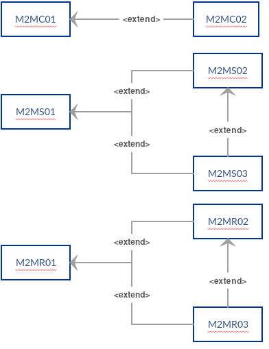

Sicurezza
=========

Il presente documento descrive i *profili* individuati da AgID che i
soggetti erogatori DOVREBBERO utilizzare per soddisfare le necessità
espresse attraverso requisiti funzionali e non funzionali.

**I profili**

-  definiscono a livello di specifica tecnologica uno “strumento
   condiviso” utile a favorire l’interoperabilità tra le pubbliche
   amministrazioni, cittadini ed imprese.

-  forniscono un comune linguaggio per fruitori ed erogatori utile a
   trattare le necessità e le caratteristiche delle *interfacce di
   servizio*.

-  offrono agli sviluppatori le modalità tecniche supportate da standard
   tecnologici documentati, revisionati e testati per esporre i *servizi
   digitali* fornendo indicazioni in risposta alle necessità.

I profili affrontano il tema della sicurezza su due livelli differenti:

-  **Canale**: definisce le modalità di trasporto dei messaggi tra i
   confini dei *domini* delle entità coinvolte.

-  **Messaggio**: definisce le modalità di comunicazione dei messaggi
   tra componenti interne dei *domini* delle entità coinvolte.

Ogni profilo è strutturato come segue:

-  **Scenario:** definizione dei requisiti funzionali e non funzionali
   soddisfatti dall’implementazione del profilo.

-  **Descrizione:** rappresentazione in linguaggio naturale del profilo
   con relativi precondizioni e obiettivi.

-  **Dettaglio:**

   -  **Flusso delle interazioni:** descrizione delle interazioni tra le
      2 parti alle interfacce.

   -  **Regole di processamento:** elenco dei passi da eseguire per
      implementare il profilo.

   -  **Tracciato:** ove presente, fornisce un esempio dei messaggi
      prodotti nell’interazione.

I soggetti interessati, a seguito dell’\ **analisi dei requisiti**
realizzata internamente, per individuare le proprie esigenze funzionali
e non funzionali, DOVREBBERO:

1. individuare tra i *profili di interazione* quelli che soddisfano le
   proprie esigenze;

2. individuare tra i *profili di sicurezza* quelli che soddisfano le
   proprie esigenze;

3. implementare le *interfacce di servizio* attraverso la combinazione
   dei *profili di interazione* e di *profili di sicurezza*.

L’individuazione dei *profili* DEVE ricoprire **solamente** i requisiti
necessari, inoltre la scelta dei profili da implementare risulta
necessaria ove l’ente erogatore del servizio non disponga già di
tecnologie che garantiscano i requisiti richiesti.

**Trust**

Il Trust è uno dei mezzi più importanti per gestire le problematiche di
sicurezza nello scambio di informazione in rete per consentire
l'interoperabilità tra i sistemi. Esso si basa sul reciproco
riconoscimento delle entità interagenti e sulla fiducia nei rispettivi
comportamenti.

Nel presente documento, per *direct trust,* si intende la relazione di
fiducia tra fruitore ed erogatore, stabilita in modalità diretta,
attraverso accordi che si basano sulla condivisione del reciproco *modus
operandi*.

**Modalità di combinazione dei profili**

I profili sono rappresentati con una sequenza di 6 caratteri:

-  i primi 3 caratteri indicano la tipologia dell’entità che comunicano:

   -  M2M -> Machine To Machine

   -  H2M -> Human To Machine

-  il quarto carattere definisce l’ambito in cui viene gestita la
   problematica di sicurezza:

   -  C: Ambito di canale ovvero livello trasporto

   -  S: Ambito applicativo basato su tecnologia SOAP

   -  R: Ambito applicativo basato su tecnologia REST

-  Gli ultimi 2 caratteri identificano univocamente il profilo.

Partendo dai requisiti di sicurezza emersi durante la fase di analisi è
possibile individuare il **profilo** o una **combinazione di più
profili** che ricoprano le esigenze.

Di seguito viene mostrata una rappresentazione dei profili attualmente
presenti nel documento in cui vengono evidenziate le relazioni.

Rappresentazione grafica delle dipendenze tra i profili

**NOTA BENE**

Le parole chiave “DEVE”, “DEVONO”, “NON DEVE”, “NON DEVONO”, “E’ RICHIESTO”,
“DOVREBBE”, “NON DOVREBBE”, “RACCOMANDATO”, “NON RACCOMANDATO”
“PUO’” e “OPZIONALE” nel testo del documento debbono essere interpretate come descritto
nel seguito, in conformità alle corrispondenti traduzioni contenute nel documento IETF
RFC 2119.

.. toctree::
  :maxdepth: 2
  :caption: Indice dei contenuti del documento Sicurezza

  doc_04/sicurezza-di-canale-eo-autenticazione-delle-organizzazioni.rst
  doc_04/autenticazione-del-soggetto-richiedente.rst
  doc_04/integrita.rst
  doc_04/soluzioni-di-sicurezza.rst
  doc_04/elenco-degli-algoritmi.rst
  doc_04/bibliografia.rst
