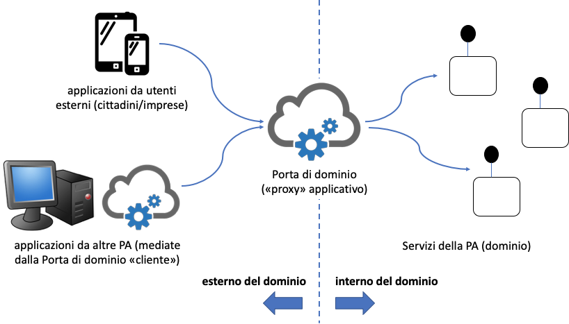
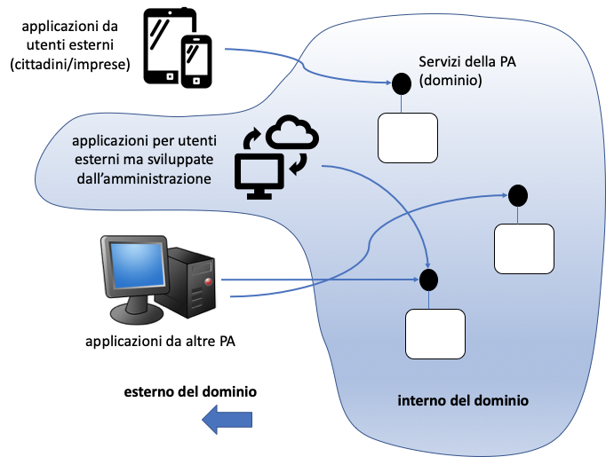

Perimetro delle interfacce di servizio
======================================

Un aspetto che si vuole qui richiamare è la relazione tra l’interno e
l’esterno del sistema informativo di una pubblica amministrazione, e
come questo confine abbia impatti sulle interfacce di servizio in
termini di funzionalità e sicurezza. Nel precedente modello di
interoperabilità (il cosiddetto SPCoop del 2005) era stato definito il
concetto di *dominio* di un’amministrazione, o *dominio di cooperazione*
tra più amministrazioni, ad indicare l'insieme delle risorse - tra cui
procedure, dati e servizi - e delle politiche di una determinata
amministrazione o gruppo di amministrazioni, e rappresentava il confine
di responsabilità, in particolar modo per quanto riguardava le politiche
relative al sistema informativo della stessa (o gruppo di
amministrazioni). Uno specifico elemento architetturale, la Porta di
Dominio, istanziava fisicamente tale confine.

Nel nuovo framework di interoperabilità, l’istanziazione della Porta di
Dominio come punto unico di interfaccia viene meno, tuttavia
concettualmente il confine continua ad esistere ed è importante
considerarlo nella progettazione delle interfacce di servizio,
soprattutto relativamente agli aspetti di sicurezza. Le interfacce di
servizio vengono offerte da qualsiasi server applicativo, senza essere
vincolate ad essere raggiungibili attraverso un unico gateway.

La **Figura 4** illustra schematicamente la differenza tra i due framework.

Quindi ogni server applicativo offre interfacce di servizio, tuttavia è
comunque significativo distinguere se l’interfaccia di servizio viene
offerta per interoperare all’interno del dominio (da parte di clienti
applicativi offerti dalla stessa amministrazione, ad es.,
un’applicazione Web od una mobile) o verso altre amministrazioni (quindi
un cliente applicativo di altra amministrazione, con cui comunque esiste
una relazione fiduciaria), oppure esternamente, da parte di moduli
applicativi completamente esterni alle pubbliche amministrazioni, e per
i quali non esiste a priori nessuna relazione, nè organizzativa nè di
fiducia. Sostanzialmente, come peraltro riportato nei Piani Triennali,
utilizzando la metafora del Sistema Informativo della Pubblica
Amministrazione italiana, diventa importante distinguere se
l’interoperabilità è interna al Sistema informativo, od a fini esterni.
Questi aspetti verranno discussi nel successivo paragrafo.

|image0|

\(a) perimetro in SPCoop

|image1|

\(b) perimetro in ModI

**Figura 4.** Perimetro delle interfacce in SPCoop e ModI

