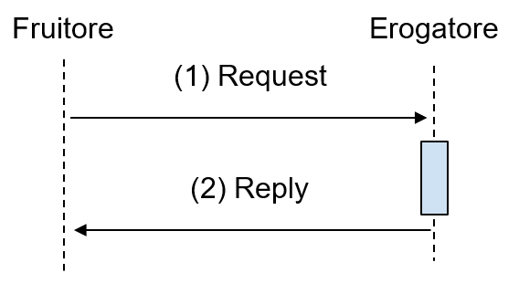

Accesso CRUD a Risorse
===========================

.. _scenario-3:

Scenario
---------------

In molti casi, le interfacce di servizio vengono utilizzate più che per
eseguire compiti complessi, al fine di eseguire operazioni di tipo CRUD
- Create, Read, Update, Delete su risorse del dominio di interesse. Ad
esempio, una prenotazione è una risorsa che può essere creata (quando
viene fissata), letta, modificata ed eliminata. Questo genere di
operazione ha durata molto breve, e quindi deve essere implementata
mediante una modalità bloccante come quella vista in Sezione 3.2.2.

.. _descrizione-3:

Descrizione
------------------

   Interazione bloccante CRUD

Il sequence diagram è, come si nota in figura, equivalente a quello di
una RPC bloccante. In questo caso la richiesta DEVE contenere:

-  Una operazione da effettuare sulla risorsa da scegliere tra Create,
   Read, Update e Delete;

-  Un percorso che indica un identificativo di risorsa (es. una
   specifica prenotazione) oppure di una collezione di risorse (es. un
   insieme di prenotazioni);

-  Nel caso di una operazione di Create o Update, un pacchetto dati
   indicante come inizializzare o modificare (anche parzialmente) la
   risorsa in questione.

Per quanto sia possibile sviluppare funzionalità CRUD anche sviluppando
una interfaccia di servizio SOAP, il ModI consiglia nei casi in cui
occorra un approccio a risorse, su cui è naturale utilizzare operazioni
CRUD, di sviluppare una interfaccia RESTful.

.. _interfaccia-rest-3:

Interfaccia REST
-----------------------

.. _regole-di-processamento-6:

Regole di processamento
~~~~~~~~~~~~~~~~~~~~~~~~~~~~~~~~

L’approccio RESTful trova la sua applicazione naturale in operazioni
CRUD - Create, Read, Update, Delete su risorse ed a tal fine sfrutta i
verbi standard dell’HTTP per indicare tali operazioni. In particolare la
seguente mappatura viene utilizzata:

+-----------------+-----------------+-----------------+-----------------+
| **CRUD**        | **Verbo HTTP**  | **Esito (stato  | **Esito (stato  |
|                 |                 | HTTP) Se        | HTTP) Se        |
|                 |                 | applicato a     | applicato a     |
|                 |                 | intera          | risorsa         |
|                 |                 | collezione (es. | specifica (es.  |
|                 |                 | /clienti)**     | /clienti/{id})**|
|                 |                 |                 |                 |
+-----------------+-----------------+-----------------+-----------------+
| Create          | POST            | 201 (Created),  | 404 (Not        |
|                 |                 | l’header        | Found), 409     |
|                 |                 | 'Location'      | (Conflict) se   |
|                 |                 | nella risposta  | la risorsa è    |
|                 |                 | può contenere   | già esistente.  |
|                 |                 | un link a       |                 |
|                 |                 | /clienti/{id}   |                 |
|                 |                 | che indica l’ID |                 |
|                 |                 | creato.         |                 |
+-----------------+-----------------+-----------------+-----------------+
| Read            | GET             | 200 (OK), lista | 200 (OK), 404   |
|                 |                 | dei clienti.    | (Not Found), se |
|                 |                 | Implementare    | l’ID non è      |
|                 |                 | meccanismi di   | stato trovato o |
|                 |                 | paginazione,    | è non valido.   |
|                 |                 | ordinamento e   |                 |
|                 |                 | filtraggio per  |                 |
|                 |                 | navigare grandi |                 |
|                 |                 | liste.          |                 |
+-----------------+-----------------+-----------------+-----------------+
| Update/Replace/ | PUT             | 405 (Method Not | 200 (OK) o 204  |
| Create          |                 | Allowed), a     | (No Content).   |
|                 |                 | meno che non si | 404 (Not        |
|                 |                 | voglia          | Found), se l’ID |
|                 |                 | sostituire ogni | non è stato     |
|                 |                 | risorsa nella   | trovato o è non |
|                 |                 | collezione.     | valido. 201     |
|                 |                 |                 | (Created), nel  |
|                 |                 |                 | caso di UPSERT. |
+-----------------+-----------------+-----------------+-----------------+
| Update/Modify   | PATCH           | 405 (Method Not | 200 (OK) o 204  |
|                 |                 | Allowed), a     | (No Content).   |
|                 |                 | meno che non si | 404 (Not        |
|                 |                 | voglia          | Found), se l’ID |
|                 |                 | applicare una   | non è stato     |
|                 |                 | modifica ad     | trovato o è non |
|                 |                 | ogni risorsa    | valido.         |
|                 |                 | nella           |                 |
|                 |                 | collezione.     |                 |
+-----------------+-----------------+-----------------+-----------------+
| Delete          | DELETE          | 405 (Method Not | 200 (OK). 404   |
|                 |                 | Allowed), a     | (Not Found), se |
|                 |                 | meno che non si | l’ID non è      |
|                 |                 | voglia          | stato trovato o |
|                 |                 | permettere di   | è non valido.   |
|                 |                 | eliminare       |                 |
|                 |                 | l’intera        |                 |
|                 |                 | collezione.     |                 |
+-----------------+-----------------+-----------------+-----------------+

Si noti in particolari l’uso distinto di PUT e PATCH per la sostituzione
e l’applicazione di modifiche ad una risorsa rispettivamente. E’
possibile utilizzare anche altri verbi HTTP a patto che si rispettino i
dettami dell’approccio RESTful.

In alcuni casi il verbo PUT può essere utilizzato con funzionalità di
UPSERT (Update o Insert). In particolare, questo è necessario nei casi
in cui sia il fruitore a definire gli identificativi del sistema
erogatore.

.. _esempio-6:

Esempio
~~~~~~~~~~~~~~~~

Al fine di illustrare l’approccio RESTful al CRUD, si farà riferimento
ad un esempio in cui si vogliano gestire le prenotazioni di un
appuntamento presso un ufficio municipale. Il servente, verifica la
compatibilità con la disponibilità nello specifico orario ed accetta o
nega la creazione o l’eventuale variazione. In particolare, come da
specifica seguente i metodi implementati sono POST (creazione), DELETE
(eliminazione), PATCH (modifica) e GET (lettura).

+---------------------------+--------------------------------------------------------------------------------------+
| Specifica Servizio Server | https://api.amministrazioneesempi o.it/rest/v1/nomeinterfacciaservi zio/openapi.yaml |
+---------------------------+--------------------------------------------------------------------------------------+
| .. code-block:: YAML                                                                                             |
|                                                                                                                  |
|   openapi: 3.0.1                                                                                                 |
|    info:                                                                                                         |
|      title: RESTCRUD                                                                                             |
|      license:                                                                                                    |
|        name: Apache 2.0 License                                                                                  |
|        url: http://www.apache.org/licenses/LICENSE-2.0.html                                                      |
|      version: "1.0"                                                                                              |
|    paths:                                                                                                        |
|      /municipio/{id_municipio}/ufficio/{id_ufficio}/prenotazioni:                                                |
|        post:                                                                                                     |
|          description: AggiungiPrenotazione                                                                       |
|          operationId: AddReservation_1                                                                           |
|          parameters:                                                                                             |
|          - name: X-Correlation-ID                                                                                |
|            in: header                                                                                            |
|            schema:                                                                                               |
|              type: string                                                                                        |
|          - name: id_municipio                                                                                    |
|            in: path                                                                                              |
|            required: true                                                                                        |
|            schema:                                                                                               |
|              type: integer                                                                                       |
|              format: int32                                                                                       |
|          - name: id_ufficio                                                                                      |
|            in: path                                                                                              |
|            required: true                                                                                        |
|            schema:                                                                                               |
|              type: integer                                                                                       |
|              format: int32                                                                                       |
|          requestBody:                                                                                            |
|            content:                                                                                              |
|              application/json:                                                                                   |
|                schema:                                                                                           |
|                  $ref: '#/components/schemas/Prenotazione'                                                       |
|          responses:                                                                                              |
|            201:                                                                                                  |
|              headers:                                                                                            |
|                Location:                                                                                         |
|                  description: ID della prenotazione creata                                                       |
|                  schema:                                                                                         |
|                    type: string                                                                                  |
|            500:                                                                                                  |
|              description: Errore interno avvenuto                                                                |
|              content:                                                                                            |
|                application/json:                                                                                 |
|                  schema:                                                                                         |
|                    $ref: '#/components/schemas/ErrorMessage'                                                     |
|            404:                                                                                                  |
|              description: Identificativo non trovato                                                             |
|              content:                                                                                            |
|                application/json:                                                                                 |
|                  schema:                                                                                         |
|                    $ref: '#/components/schemas/ErrorMessage'                                                     |
|            400:                                                                                                  |
|              description: Richiesta non accoglibile                                                              |
|              content:                                                                                            |
|                application/json:                                                                                 |
|                  schema:                                                                                         |
|                    $ref: '#/components/schemas/ErrorMessage'                                                     |
|      /municipio/{id_municipio}/ufficio/{id_ufficio}/prenotazioni/{id_prenotazione}:                              |
|        get:                                                                                                      |
|          description: LeggiPrenotazione                                                                          |
|          operationId: GetReservation_1                                                                           |
|          parameters:                                                                                             |
|          - name: id_municipio                                                                                    |
|            in: path                                                                                              |
|            required: true                                                                                        |
|            schema:                                                                                               |
|              type: integer                                                                                       |
|              format: int32                                                                                       |
|          - name: id_ufficio                                                                                      |
|            in: path                                                                                              |
|            required: true                                                                                        |
|            schema:                                                                                               |
|              type: integer                                                                                       |
|              format: int32                                                                                       |
|          - name: id_prenotazione                                                                                 |
|            in: path                                                                                              |
|            required: true                                                                                        |
|            schema:                                                                                               |
|              type: integer                                                                                       |
|              format: int32                                                                                       |
|          responses:                                                                                              |
|            500:                                                                                                  |
|              description: Errore interno avvenuto                                                                |
|              content:                                                                                            |
|                application/json:                                                                                 |
|                  schema:                                                                                         |
|                    $ref: '#/components/schemas/ErrorMessage'                                                     |
|            404:                                                                                                  |
|              description: Identificativo non trovato                                                             |
|              content:                                                                                            |
|                application/json:                                                                                 |
|                  schema:                                                                                         |
|                    $ref: '#/components/schemas/ErrorMessage'                                                     |
|            200:                                                                                                  |
|              description: Prenotazione estratta correttamente                                                    |
|              content:                                                                                            |
|                application/json:                                                                                 |
|                  schema:                                                                                         |
|                    $ref: '#/components/schemas/Prenotazione'                                                     |
|        delete:                                                                                                   |
|          description: EliminaPrenotazione                                                                        |
|          operationId: DeleteReservation                                                                          |
|          parameters:                                                                                             |
|          - name: id_municipio                                                                                    |
|            in: path                                                                                              |
|            required: true                                                                                        |
|            schema:                                                                                               |
|              type: integer                                                                                       |
|              format: int32                                                                                       |
|          - name: id_ufficio                                                                                      |
|            in: path                                                                                              |
|            required: true                                                                                        |
|            schema:                                                                                               |
|              type: integer                                                                                       |
|              format: int32                                                                                       |
|          - name: id_prenotazione                                                                                 |
|            in: path                                                                                              |
|            required: true                                                                                        |
|            schema:                                                                                               |
|              type: integer                                                                                       |
|              format: int32                                                                                       |
|          responses:                                                                                              |
|            500:                                                                                                  |
|              description: Errore interno avvenuto                                                                |
|              content:                                                                                            |
|                application/json:                                                                                 |
|                  schema:                                                                                         |
|                    $ref: '#/components/schemas/ErrorMessage'                                                     |
|            404:                                                                                                  |
|              description: Identificativo non trovato                                                             |
|              content:                                                                                            |
|                application/json:                                                                                 |
|                  schema:                                                                                         |
|                    $ref: '#/components/schemas/ErrorMessage'                                                     |
|            200:                                                                                                  |
|              description: Prenotazione eliminata correttamente                                                   |
|              content:                                                                                            |
|                application/json:                                                                                 |
|                  schema:                                                                                         |
|                    $ref: '#/components/schemas/Prenotazione'                                                     |
|        patch:                                                                                                    |
|          description: ModificaPrenotazione                                                                       |
|          operationId: PatchReservation                                                                           |
|          parameters:                                                                                             |
|          - name: id_municipio                                                                                    |
|            in: path                                                                                              |
|            required: true                                                                                        |
|            schema:                                                                                               |
|              type: integer                                                                                       |
|              format: int32                                                                                       |
|          - name: id_ufficio                                                                                      |
|            in: path                                                                                              |
|            required: true                                                                                        |
|            schema:                                                                                               |
|              type: integer                                                                                       |
|              format: int32                                                                                       |
|          - name: id_prenotazione                                                                                 |
|            in: path                                                                                              |
|            required: true                                                                                        |
|            schema:                                                                                               |
|              type: integer                                                                                       |
|              format: int32                                                                                       |
|          requestBody:                                                                                            |
|            content:                                                                                              |
|              application/json:                                                                                   |
|                schema:                                                                                           |
|                  $ref: '#/components/schemas/PatchPrenotazione'                                                  |
|          responses:                                                                                              |
|            500:                                                                                                  |
|              description: Errore interno avvenuto                                                                |
|              content:                                                                                            |
|                application/json:                                                                                 |
|                  schema:                                                                                         |
|                    $ref: '#/components/schemas/ErrorMessage'                                                     |
|            404:                                                                                                  |
|              description: Identificativo non trovato                                                             |
|              content:                                                                                            |
|                application/json:                                                                                 |
|                  schema:                                                                                         |
|                    $ref: '#/components/schemas/ErrorMessage'                                                     |
|            200:                                                                                                  |
|              description: Prenotazione modificata correttamente                                                  |
|              content:                                                                                            |
|                application/json:                                                                                 |
|                  schema:                                                                                         |
|                    $ref: '#/components/schemas/Prenotazione'                                                     |
|    components:                                                                                                   |
|      schemas:                                                                                                    |
|        Prenotazione:                                                                                             |
|          type: object                                                                                            |
|          properties:                                                                                             |
|            nome:                                                                                                 |
|              type: string                                                                                        |
|            cognome:                                                                                              |
|              type: string                                                                                        |
|            cf:                                                                                                   |
|              type: string                                                                                        |
|            dettagli:                                                                                             |
|              $ref: '#/components/schemas/PatchPrenotazione'                                                      |
|        PatchPrenotazione:                                                                                        |
|          type: object                                                                                            |
|          properties:                                                                                             |
|            data:                                                                                                 |
|              type: string                                                                                        |
|              format: date-time                                                                                   |
|            ora:                                                                                                  |
|              type: string                                                                                        |
|            motivazione:                                                                                          |
|              type: string                                                                                        |
|        ErrorMessage:                                                                                             |
|          type: object                                                                                            |
|          properties:                                                                                             |
|            error_message:                                                                                        |
|              type: string                                                                                        |
+------------------------------------------------------------------------------------------------------------------+

Di seguito un esempio di chiamata in cui il fruitore richiede la
creazione di una prenotazione.

+------------------------------------------------------------+----------------------------------------------------------------------------------------------------------------------------------------------+
| HTTP Operation                                             | POST                                                                                                                                         |
+------------------------------------------------------------+----------------------------------------------------------------------------------------------------------------------------------------------+
| Endpoint                                                   | https://api.amministrazioneesempio.it/rest/v1/nomeinterfacciaservizio/municipio/{id_municipio}/ufficio/{id_ufficio}/prenotazioni             |
+------------------------------------------------------------+----------------------------------------------------------------------------------------------------------------------------------------------+
| \(1) Request Header & Body                                 | .. code-block:: JSON                                                                                                                         |
|                                                            |                                                                                                                                              |
|                                                            |    X-Correlation-ID: 69a445fb-6a9f-44fe-b1c3-59c0f7fb568d                                                                                    |
|                                                            |                                                                                                                                              |
|                                                            |    {                                                                                                                                         |
|                                                            |      "nome": "string",                                                                                                                       |
|                                                            |      "cognome": "string",                                                                                                                    |
|                                                            |      "cf": "string",                                                                                                                         |
|                                                            |      "dettagli": {                                                                                                                           |
|                                                            |        "data": "2018-12-03T14:29:12.137Z",                                                                                                   |
|                                                            |        "motivazione": "string"                                                                                                               |
|                                                            |      }                                                                                                                                       |
|                                                            |    }                                                                                                                                         |
+------------------------------------------------------------+----------------------------------------------------------------------------------------------------------------------------------------------+
| \(2) Response Header & Body (HTTP Status Code 201 Created) | .. code-block:: JSON                                                                                                                         |
|                                                            |                                                                                                                                              |
|                                                            |    Location:                                                                                                                                 |
|                                                            |    https://api.amministrazioneesempio.it/rest/v1/nomeinterfacciaservizio/municipio/{id_municipio}/ufficio/{id_ufficio}/prenotazioni/12323254 |
+------------------------------------------------------------+----------------------------------------------------------------------------------------------------------------------------------------------+

Di seguito un esempio in cui il fruitore richiede l’estrazione di una
specifica prenotazione. Si noti l’utilizzo dell’URL restituito
nell’header HTTP Location al passo precedente.

+-------------------------------------------+-------------------------------------------------------------------------------------------------------------------------------------------+
| HTTP Operation                            | GET                                                                                                                                       |
+-------------------------------------------+-------------------------------------------------------------------------------------------------------------------------------------------+
| Endpoint                                  | https://api.amministrazioneesempio.it/rest/v1/nomeinterfacciaservizio/municipio/{id_municipio}/ufficio/{id_ufficio}/prenotazioni/12323254 |
+-------------------------------------------+-------------------------------------------------------------------------------------------------------------------------------------------+
| \(2) Response Body (HTTP Status Code 200) | .. code-block:: JSON                                                                                                                      |
|                                           |                                                                                                                                           |
|                                           |    {                                                                                                                                      |
|                                           |      "nome": "string",                                                                                                                    |
|                                           |      "cognome": "string",                                                                                                                 |
|                                           |      "cf": "string",                                                                                                                      |
|                                           |      "dettagli": {                                                                                                                        |
|                                           |        "data": "2018-12-03T14:29:12.137Z",                                                                                                |
|                                           |        "motivazione": "string"                                                                                                            |
|                                           |      }                                                                                                                                    |
|                                           |    }                                                                                                                                      |
+-------------------------------------------+-------------------------------------------------------------------------------------------------------------------------------------------+

Di seguito un esempio in cui il fruitore richiede la modifica di una
prenotazione per quanto riguarda i dettagli.

+-------------------------------------------+-------------------------------------------------------------------------------------------------------------------------------------------+
| HTTP Operation                            | PATCH                                                                                                                                     |
+-------------------------------------------+-------------------------------------------------------------------------------------------------------------------------------------------+
| Endpoint                                  | https://api.amministrazioneesempio.it/rest/v1/nomeinterfacciaservizio/municipio/{id_municipio}/ufficio/{id_ufficio}/prenotazioni/12323254 |
+-------------------------------------------+-------------------------------------------------------------------------------------------------------------------------------------------+
| \(1) Request Header & Body                | .. code-block:: JSON                                                                                                                      |
|                                           |                                                                                                                                           |
|                                           |    {                                                                                                                                      |
|                                           |      "data": "2018-12-03T14:29:12.137Z",                                                                                                  |
|                                           |      "motivazione": "nuova motivazione"                                                                                                   |
|                                           |    }                                                                                                                                      |
+-------------------------------------------+-------------------------------------------------------------------------------------------------------------------------------------------+
| \(2) Response Body (HTTP Status Code 200) |                                                                                                                                           |
+-------------------------------------------+-------------------------------------------------------------------------------------------------------------------------------------------+

Di seguito un esempio in cui il fruitore richiede di eliminare una
specifica prenotazione.

+----------------------------------------------+-------------------------------------------------------------------------------------------------------------------------------------------+
| HTTP Operation                               | DELETE                                                                                                                                    |
+----------------------------------------------+-------------------------------------------------------------------------------------------------------------------------------------------+
| Endpoint                                     | https://api.amministrazioneesempio.it/rest/v1/nomeinterfacciaservizio/municipio/{id_municipio}/ufficio/{id_ufficio}/prenotazioni/12323254 |
+----------------------------------------------+-------------------------------------------------------------------------------------------------------------------------------------------+
| \(2) Response Body (HTTP Status Code 200 OK) |                                                                                                                                           |
+----------------------------------------------+-------------------------------------------------------------------------------------------------------------------------------------------+
