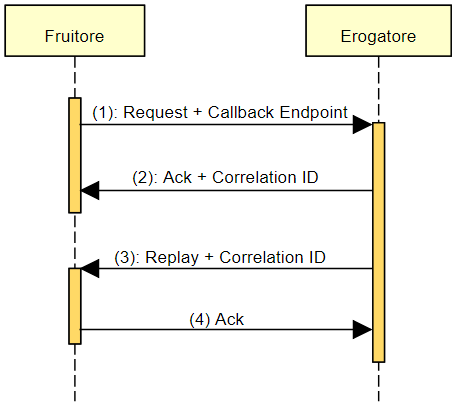
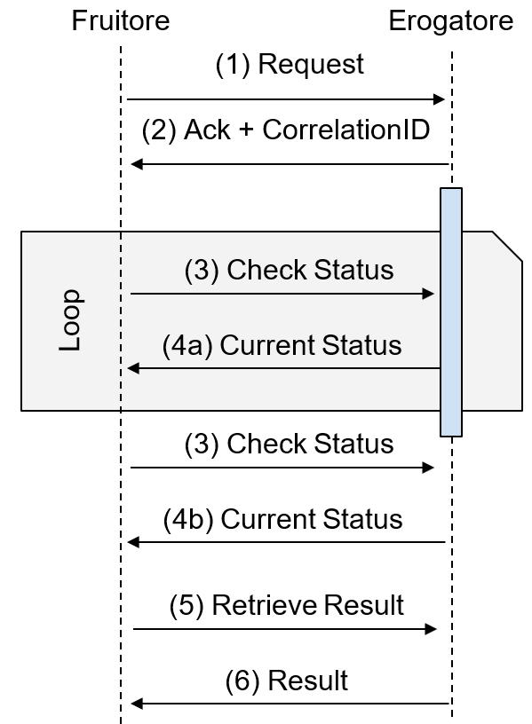

Profili non bloccanti
=====================

Nel seguito del capitolo verranno mostrati i profili di interazione
non bloccante, in cui un fruitore sottomette una richiesta e questa
viene solo presa in carico immediatamente, mentre il suo soddisfacimento
può avvenire in maniera differita.

Gli approcci non bloccanti vengono utilizzati nei casi in cui i tempi
per l’erogazione di una risposta da parte del fruitore sono lunghi
perché (i) la richiesta è onerosa in termini temporali e/o (ii) il
fruitore non può farsi immediatamente carico dell’erogazione del
servizio.

Al fine di collegare le richieste con le risposte si farà uso, sia nelle
implementazioni SOAP che in quelle REST, di meta-informazioni specifiche
(quali il correlation ID ed l’endpoint per le callback). Queste sono
estranee solitamente alla business logic del servizio, ma è necessario
definirle a livello di interfaccia di servizio ai fini
dell’interoperabilità. A tal fine verranno definiti header(HTTP nel
caso REST ed envelope nel caso SOAP) utili a contenere queste
informazioni.

In alcuni casi, una interfaccia di servizio viene creata al fine di
automatizzare o semplificare un servizio già offerto dalla pubblica
amministrazione. In una moltitudine di casi questi servizi sono
asincroni (non bloccanti) per natura, e consistono di richieste a cui
vengono allegati degli identificativi (es. numeri di protocollo) che
accompagnano la pratica. In questi casi, il correlation ID può essere
sostituito da questi identificativi già previsti dal servizio.

.. _paragrafo-1:

Profili non bloccante RPC PUSH (basato su callback)
---------------------------------------------------

.. _scenario-1:

Scenario
~~~~~~~~

Questo caso particolare, denominato RPC PUSH, è utilizzabile nel caso in
cui il fruitore abbia a sua volta possibilità di esporre una interfaccia
di servizio per la ricezione delle risposte.

.. _descrizione-1:

Descrizione
~~~~~~~~~~~

   
   Interazione non bloccante tramite callback

In questo scenario (vedi figura), la richiesta del fruitore contiene
un riferimento al servizio da chiamare al momento della risposta. Si
suppone infatti che i fruitori espongano a loro volta delle interfacce
con segnatura standard. Al momento del ricevimento della richiesta
(passo (1)), l’erogatore risponde (passo (2)) riconoscendo l’avvenuta
ricezione (acknowledgement o in breve ack) ed indica un correlation ID
(ID di correlazione), generato lato erogatore, che permetta al fruitore,
una volta ricevuta la risposta, di accoppiarla alla richiesta originale.
Quando il processamento è terminato infatti, l’erogatore (passo (3))
chiama il fruitore (invertendo quindi i ruoli chiamato/chiamante)
riportando l’esito ed indicando il correlation ID. Il fruitore riconosce
(sempre mediante un messaggio di ack) la ricezione della risposta (passo
(4)).

Il profilo basato su callback è un caso particolare di publish/subscribe
(vedi Capitolo 3). Nel publish/subscribe, il sottoscrittore (cioè il
fruitore) richiede di ricevere aggiornamenti circa un determinato
argomento ad uno specifico indirizzo. Nel caso della callback,
l’argomento è rappresentato dallo stato di esecuzione di una richiesta.

.. _interfaccia-rest-1:

Interfaccia REST
~~~~~~~~~~~~~~~~

Nel caso in cui il profilo venga implementato con tecnologia REST,
DEVONO essere rispettate le seguenti regole:

-  Le specifiche delle interfacce del fruitore e dell’erogatore DEVONO
   dichiarare tutti i codici di stato HTTP restituiti con relativo
   schema della risposta, oltre che ad eventuali header HTTP restituiti;

-  Le specifiche delle interfacce del fruitore e dell’erogatore DEVONO
   dichiarare gli schemi delle richieste insieme ad eventuali header
   HTTP richiesti;

-  La specifica dell’interfaccia dell’erogatore deve dichiarare tramite
   il formalismo specifico [1]_ il formato delle callback; questa
   specifica deve essere rispettata dall’interfaccia esposta dal
   fruitore, e quindi nella rispettiva specifica;

-  Al passo (1), il fruitore DEVE indicare l’endpoint della callback
   utilizzando l’header HTTP custom X-ReplyTo; Il verbo HTTP utilizzato
   deve essere POST;

-  Al passo (2), l’erogatore DEVE fornire insieme all’acknowledgement
   della richiesta nel body, il correlation ID utilizzando l’header HTTP
   custom X-CorrelationID; Il codice HTTP di stato DEVE essere 202
   Accepted a meno che non si verifichino errori;

-  Al passo (3), l’erogatore DEVE riutilizzare lo stesso correlation ID
   fornito al passo (2) sempre utilizzando l’header HTTP custom
   X-CorrelationID; Il verbo HTTP utilizzato deve essere POST;

-  Al passo (4), il fruitore DEVE riconoscere tramite un messaggio di
   acknowledgement il ricevimento della risposta; Il codice HTTP di
   stato DEVE essere 200 OK a meno che non si verifichino errori.

Il corpo dei messaggi HTTP scambiati durante l’interazione DEVE seguire
lo standard JSON.

.. _regole-di-processamento-2:

Regole di processamento
^^^^^^^^^^^^^^^^^^^^^^^

Al termine del processamento delle richieste, l’erogatore ed il fruitore
devono fare uso dei codici di stato HTTP rispettandone la
semantica [2]_. In particolare, al ricevimento della richiesta da parte
del fruitore (risp. dell’erogatore), l’erogatore (risp. il fruitore)
DEVE almeno:

-  Verificare la validità sintattica dei dati in ingresso. In caso di
   dati errati deve restituire il codice HTTP 400 Bad Request fornendo
   nel body di risposta dettagli circa l’errore;

-  Nel caso in cui qualcuno degli ID nel path o nel body non esista,
   DEVE restituire il codice 404 Not Found, indicando nel body di
   risposta quale degli ID è mancante;

-  In caso di errori non dipendenti dal fruitore, DEVE restituire i
   codici HTTP 5XX rispettando la semantica degli stessi ed indicando
   nel body di risposta il motivo dell’errore;

-  Al momento della ricezione della richiesta, l’erogatore restituisce
   il codice 202 Accepted. In caso di ricezione corretta della risposta,
   il fruitore restituire il codice HTTP 200 OK, riempiendo il body di
   risposta con un acknowledgement dell’avvenuta ricezione. Nel caso di
   errore al momento di ricezione della risposta da parte del fruitore,
   è possibile definire meccanismi specifici per la ritrasmissione della
   risposta o della richiesta.

.. _esempio-2:

Esempio
^^^^^^^

+---------------------------+-----------------------------------------------------------------------------------------------+
| Specifica Servizio Server | https://api.amministrazioneesempio.it/rest/v1/nomeinterfacciaservizio/RESTCallbackServer.yaml |
+---------------------------+-----------------------------------------------------------------------------------------------+
| .. literalinclude:: ../media/rest-callback-server.yaml                                                                    |
|    :language: yaml                                                                                                        |
|    :linenos:                                                                                                              |
+---------------------------------------------------------------------------------------------------------------------------+

+---------------------------+----------------------------------------------------------------------------------------+
| Specifica Servizio Client | https://api.indirizzoclient.it/rest/v1/nomeinterfacciaservizio/RESTCallbackClient.yaml |
+---------------------------+----------------------------------------------------------------------------------------+
| .. literalinclude:: ../media/rest-callback-client.yaml                                                             |
|    :language: yaml                                                                                                 |
|    :linenos:                                                                                                       |
+--------------------------------------------------------------------------------------------------------------------+

Di seguito un esempio di chiamata al metodo M con la presa in carico da
parte dell’erogatore.

+---------------------------------+----------------------------------------------------------------------------------------+
| HTTP Operation                  | POST                                                                                   |
+---------------------------------+----------------------------------------------------------------------------------------+
| Endpoint                        | https://api.amministrazioneesempio.it/rest/v1/nomeinterfacciaservizio/resources/1234/M |
+---------------------------------+----------------------------------------------------------------------------------------+
| 1 Request Header & Body         | .. code-block:: JSON                                                                   |
|                                 |                                                                                        |
|                                 |                                                                                        |
|                                 |     X-ReplyTo: https://api.indirizzoclient.it/rest/v1/nomeinterfacciaclient/Mresponse  |
|                                 |                                                                                        |
|                                 |     {                                                                                  |
|                                 |       "a": {                                                                           |
|                                 |         "a1": [1,...,2],                                                               |
|                                 |         "a2": "RGFuJ3MgVG9vbHMgYXJlIGNvb2wh"                                           |
|                                 |       },                                                                               |
|                                 |       "b": "Stringa di esempio"                                                        |
|                                 |     }                                                                                  |
+---------------------------------+----------------------------------------------------------------------------------------+
| 2 Response Header & Body        | .. code-block:: JSON                                                                   |
| (HTTP Status Code 202 Accepted) |                                                                                        |
|                                 |                                                                                        |
|                                 |     X-Correlation-ID: 69a445fb-6a9f-44fe-b1c3-59c0f7fb568d                             |
|                                 |                                                                                        |
|                                 |     {                                                                                  |
|                                 |       "result" : "ACK"                                                                 |
|                                 |     }                                                                                  |
+---------------------------------+----------------------------------------------------------------------------------------+

Di seguito un esempio di risposta da parte dell’erogatore verso il fruitore.

+---------------------------------+------------------------------------------------------------------------+
| HTTP Operation                  | POST                                                                   |
+---------------------------------+------------------------------------------------------------------------+
| Endpoint                        | https://api.indirizzoclient.it/rest/v1/nomeinterfacciaclient/Mresponse |
+---------------------------------+------------------------------------------------------------------------+
| 3 Request Header & Body         | .. code-block:: JSON                                                   |
|                                 |                                                                        |
|                                 |    X-Correlation-ID: 69a445fb-6a9f-44fe-b1c3-59c0f7fb568d              |
|                                 |                                                                        |
|                                 |     {                                                                  |
|                                 |       "c": "OK"                                                        |
|                                 |     }                                                                  |
+---------------------------------+------------------------------------------------------------------------+
| 4 Response Header & Body        | .. code-block:: JSON                                                   |
| (HTTP Status Code 202 Accepted) |                                                                        |
|                                 |     {                                                                  |
|                                 |       "result" : "ACK"                                                 |
|                                 |     }                                                                  |
+---------------------------------+------------------------------------------------------------------------+

.. _interfaccia-soap-1:

Interfaccia SOAP
~~~~~~~~~~~~~~~~~~~~~~~~~

Nel caso di implementazione mediante tecnologia SOAP, l’endpoint di
callback ed il correlation ID, vengono inseriti all’interno dell’header
SOAP come campi custom. Erogatore e fruitore DEVONO inoltre seguire le
seguenti regole:

-  Le specifica delle interfacce del fruitore e dell’erogatore DEVONO
   dichiarare tutti i metodi esposti con relativi schemi dei messaggi di
   richiesta e di ritorno. Inoltre le interfacce devono specificare
   eventuali header SOAP richiesti;

-  La specifica dell’interfaccia del fruitore DEVE rispettare quanto
   richiesto dall’erogatore; in particolare, non esistendo un
   equivalente in WSDL del formalismo per le callback, si richiede che
   l’erogatore fornisca un WSDL di esempio su un endpoint differente da
   quello del servizio; il fruitore svilupperà quindi un servizio che
   rispetta questa specifica al fine di fornire un endpoint di callback;

-  Al passo (1), il fruitore DEVE indicare l’endpoint della callback
   utilizzando l’header SOAP custom X-ReplyTo;

-  Al passo (2), l’erogatore DEVE fornire insieme all’acknowledgement
   della richiesta nel body, il correlation ID utilizzando l’header SOAP
   custom X-CorrelationID;

-  Al passo (3), l’erogatore DEVE riutilizzare lo stesso correlation ID
   fornito al passo (2) sempre utilizzando l’header SOAP custom
   X-CorrelationID;

-  Al passo (4), il fruitore DEVE riconoscere tramite un messaggio di
   acknowledgement il ricevimento della risposta.

Il corpo dei messaggi HTTP scambiati durante l’interazione DEVE seguire
lo standard XML.

.. _regole-di-processamento-3:

Regole di processamento
^^^^^^^^^^^^^^^^^^^^^^^

Sebbene la specifica SOAP proponga l’utilizzo dei codici di stato HTTP
al fine di indicare l’esito di una richiesta, il ModI richiede di
seguire le seguenti regole, come supportato dalla maggioranza dei
framework di sviluppo:

-  In caso di successo di una richiesta, il codice di stato HTTP DEVE
   essere 200 OK. Questo vale anche per il passo (2) del profilo a
   differenza del caso REST;

-  In caso di errore si DEVE utilizzare il codice di stato 500
   accompagnato dal meccanismo basato su WS fault. Questo vale per
   errori nella validazione, sia sintattica che semantica dei messaggi e
   per eventuali errori interni, permettendo al chiamante (il fruitore
   al passo (1) e l’erogatore al passo (3)) di identificare con
   precisione l’errore.

.. _esempio-3:

Esempio
^^^^^^^

+----------------------------------------------+----------------------------------------------------------------------------+
| Specifica Servizio Server                    | https://api.amministrazioneesempio.it/soap/nomeinterfacciaservizio/v1?wsdl |
+----------------------------------------------+----------------------------------------------------------------------------+
| .. literalinclude:: ../media/soap-callback-server.wsdl                                                                    |
|    :language: yaml                                                                                                        |
|    :linenos:                                                                                                              |
+---------------------------------------------------------------------------------------------------------------------------+

+-------------------------------------------------+-------------------------------------------------------------------------+
| Specifica Servizio Callback                     | https://api.indirizzoclient.it/soap/nomeinterfacciaservizio/v1?wsdl     |
+-------------------------------------------------+-------------------------------------------------------------------------+
| .. literalinclude:: ../media/soap-callback-client.wsdl                                                                    |
|    :language: yaml                                                                                                        |
|    :linenos:                                                                                                              |
+---------------------------------------------------------------------------------------------------------------------------+

Segue un esempio di chiamata al metodo M in cui l’erogatore conferma di
essersi preso carico della richiesta.

+-----------------+----------------------------------------------------------------------------------------------------------------------------------------------------------------------------+
| Endpoint        | https://api.amministrazioneesempio.it/soap/nomeinterfacciaservizio/v1                                                                                                      |
+-----------------+----------------------------------------------------------------------------------------------------------------------------------------------------------------------------+
| Method          | MRequest                                                                                                                                                                   |
+-----------------+----------------------------------------------------------------------------------------------------------------------------------------------------------------------------+
| 1 Request Body  | .. code-block:: XML                                                                                                                                                        |
|                 |                                                                                                                                                                            |
|                 |     <soap:Envelope xmlns:soap="http://schemas.xmlsoap.org/soap/envelope/">                                                                                                 |
|                 |       <soap:Header>                                                                                                                                                        |
|                 |         <ns2:X-ReplyTo xmlns:ns2="http://amministrazioneesempio.it/nomeinterfacciaservizio">http:///api.indirizzoclient.it/soap/nomeinterfacciaservizio/v1</ns2:X-ReplyTo> |
|                 |       </soap:Header>                                                                                                                                                       |
|                 |       <soap:Body>                                                                                                                                                          |
|                 |         <ns2:MRequest xmlns:ns2="http://amministrazioneesempio.it/nomeinterfacciaservizio">                                                                                |
|                 |           <M>                                                                                                                                                              |
|                 |            <o_id>1234</o_id>                                                                                                                                               |
|                 |             <a>                                                                                                                                                            |
|                 |              <a1s><a1>1</a1>...<a1>2</a1></a1s>                                                                                                                            |
|                 |              <a2>Stringa di esempio</a2>                                                                                                                                   |
|                 |             </a>                                                                                                                                                           |
|                 |             <b>Stringa di esempio</b>                                                                                                                                      |
|                 |           </M>                                                                                                                                                             |
|                 |         </ns2:MRequest>                                                                                                                                                    |
|                 |       </soap:Body>                                                                                                                                                         |
|                 |     </soap:Envelope>                                                                                                                                                       |
+-----------------+----------------------------------------------------------------------------------------------------------------------------------------------------------------------------+
| 2 Response Body | .. code-block:: XML                                                                                                                                                        |
|                 |                                                                                                                                                                            |
|                 |     <soap:Envelope xmlns:soap="http://schemas.xmlsoap.org/soap/envelope/">                                                                                                 |
|                 |       <soap:Header>                                                                                                                                                        |
|                 |         <ns2:X-CorrelationID xmlns:ns2="http://amministrazioneesempio.it/nomeinterfacciaservizio">4d826a26-4cd8-4b03-9bc1-2b48e89f0f40</ns2:X-CorrelationID>               |
|                 |       </soap:Header>                                                                                                                                                       |
|                 |       <soap:Body>                                                                                                                                                          |
|                 |       <ns2:MRequestResponse xmlns:ns2="http://amministrazioneesempio.it/nomeinterfacciaservizio">                                                                          |
|                 |           <return>                                                                                                                                                         |
|                 |             <outcome>ACCEPTED</outcome>                                                                                                                                    |
|                 |           </return>                                                                                                                                                        |
|                 |         </ns2:MRequestResponse>                                                                                                                                            |
|                 |       </soap:Body>                                                                                                                                                         |
|                 |     </soap:Envelope>                                                                                                                                                       |
+-----------------+----------------------------------------------------------------------------------------------------------------------------------------------------------------------------+

+-------------------+----------------------------------------------------------------------------------------------------------------------------------------------------------------+
| Endpoint          | https://api.indirizzoclient.it/soap/nomeinterfacciaclient/v1                                                                                                   |
+-------------------+----------------------------------------------------------------------------------------------------------------------------------------------------------------+
| Method            | MRequestResponse                                                                                                                                               |
+-------------------+----------------------------------------------------------------------------------------------------------------------------------------------------------------+
| (3) Request Body  | .. code-block:: XML                                                                                                                                            |
|                   |                                                                                                                                                                |
|                   |    <soap:Envelope xmlns:soap="http://schemas.xmlsoap.org/soap/envelope/">                                                                                      |
|                   |      <soap:Header>                                                                                                                                             |
|                   |        <ns2:X-CorrelationID xmlns:ns2="http://amministrazioneesempio.it/   nomeinterfacciaservizio">4d826a26-4cd8-4b03-9bc1-2b48e89f0f40</ns2:X-CorrelationID> |
|                   |      </soap:Header>                                                                                                                                            |
|                   |      <soap:Body>                                                                                                                                               |
|                   |        <ns2:MRequestResponse xmlns:ns2="http://amministrazioneesempio.it/nomeinterfacciaservizio">                                                             |
|                   |          <return>                                                                                                                                              |
|                   |            <c>OK</c>                                                                                                                                           |
|                   |          </return>                                                                                                                                             |
|                   |        </ns2:MRequestResponse>                                                                                                                                 |
|                   |      </soap:Body>                                                                                                                                              |
|                   |    </soap:Envelope>                                                                                                                                            |
+-------------------+----------------------------------------------------------------------------------------------------------------------------------------------------------------+
| (4) Response Body |                                                                                                                                                                |
|                   | .. code-block:: XML                                                                                                                                            |
|                   |                                                                                                                                                                |
|                   |    <soap:Envelope xmlns:soap="http://schemas.xmlsoap.org/soap/envelope/">                                                                                      |
|                   |      <soap:Body>                                                                                                                                               |
|                   |        <ns2:MRequestResponseResponse xmlns:ns2="http://amministrazioneesempio.it/nomeinterfacciaservizio">                                                     |
|                   |          <return>                                                                                                                                              |
|                   |            <outcome>ACK</outcome>                                                                                                                              |
|                   |          </return>                                                                                                                                             |
|                   |        </ns2:MRequestResponseResponse>                                                                                                                         |
|                   |      </soap:Body>                                                                                                                                              |
|                   |    </soap:Envelope>                                                                                                                                            |
+-------------------+----------------------------------------------------------------------------------------------------------------------------------------------------------------+

.. _paragrafo-2:

Profilo non bloccante RPC PULL (busy waiting)
---------------------------------------------

.. _scenario-2:

Scenario
~~~~~~~~

Questo scenario è simile al precedente, di cui eredita le motivazioni,
ma in questo caso si decide, per ragioni ad esempio dovute e limitazioni
circa le tecnologie utilizzate o i protocolli di rete, che il fruitore
non fornisce un indirizzo per le risposte (metodo di callback), mentre
l’erogatore fornisce un indirizzo interrogabile per verificare lo stato
di processamento di una richiesta e, al fine del processamento della
stessa, il risultato.

.. _descrizione-2:

Descrizione
~~~~~~~~~~~

Interazione non bloccante tramite busy waiting

Come si può vedere in figura, il fruitore invia una richiesta (passo
(1)) e riceve immediatamente dall’erogatore un messaggio di avvenuta
ricezione insieme ad un indirizzo presso il quale verificare lo stato
del processamento (caso REST) oppure un correlation ID (caso SOAP)
(passo (2)). Da questo momento in poi il fruitore, ad intervalli
periodici, richiede lo stato di processamento della sua richiesta
utilizzando l’endpoint indicato oppure il correlation ID (passo (3)) fin
quando la risposta alla richiesta sarà pronta (passi (4a) e (4b)). Gli
intervalli permessi da parte da parte dell’erogatore possono essere
definiti tramite meccanismi di robustezza quali quelli definiti in
Sezione 2.5. A questo punto il fruitore può richiedere il risultato
(passi (5) e (6)).

.. _interfaccia-rest-2:

Interfaccia REST
~~~~~~~~~~~~~~~~

Nel caso in cui il profilo venga implementato con tecnologia REST,
DEVONO essere rispettate le seguenti regole (che riflettono l’esempio 2
riportato nel Capitolo 1):

-  La specifica dell’interfaccia dell’erogatore DEVE dichiarare tutti i
   codici di stato HTTP restituiti con relativo schema della risposta,
   oltre che ad eventuali header HTTP restituiti;

-  La specifica dell’interfaccia DEVE dichiarare gli schemi delle
   richieste insieme ad eventuali header HTTP richiesti;

-  Al passo (1), il fruitore DEVE utilizzare il verbo HTTP POST;

-  Al passo (2), l’erogatore DEVE fornire insieme all’acknowledgement
   della richiesta nel body, un percorso di risorsa per interrogare lo
   stato di processamento della richiesta utilizzando l’header HTTP
   standard Location; Il codice HTTP di stato DEVE essere 202 Accepted a
   meno che non si verifichino errori;

-  Al passo (3), il fruitore DEVE utilizzare il percorso di cui al passo
   (2) per richiedere lo stato di processamento; Il verbo HTTP
   utilizzato deve essere GET;

-  Al passo (4a) l’erogatore indica che il processamento non si è ancora
   concluso, fornendo informazioni circa lo stato della lavorazione
   della richiesta; il codice HTTP restituito è 200 OK;

-  Nel caso il processamento si sia concluso (passo (4b), l’erogatore
   risponde con il codice HTTP 303 See Other; il percorso per ottenere
   la risposta è indicato nell’header standard Location;

-  Al passo (5), il fruitore utilizza il percorso di cui al passo (4b)
   al fine di richiedere il risultato della richiesta. Il verbo HTTP
   utilizzato deve essere GET;

-  Al passo (6), l’erogatore fornisce il risultato del processamento.

Il corpo dei messaggi HTTP scambiati durante l’interazione DEVE seguire
lo standard JSON.

.. _regole-di-processamento-4:

Regole di processamento
^^^^^^^^^^^^^^^^^^^^^^^^^^^^^^^^^^

Al termine del processamento delle richieste, l’erogatore deve fare uso
dei codici di stato HTTP rispettandone la semantica [3]_. In
particolare, al ricevimento della richiesta da parte del fruitore,
l’erogatore DEVE almeno:

-  Verificare la validità sintattica dei dati in ingresso. In caso di
   dati errati deve restituire il codice HTTP 400 Bad Request fornendo
   nel body di risposta dettagli circa l’errore;

-  Nel caso in cui qualcuno degli ID nel path o nel body non esista,
   DEVE restituire il codice 404 Not Found, indicando nel body di
   risposta quale degli ID è mancante;

-  In caso di errori non dipendenti dal fruitore, DEVE restituire i
   codici HTTP 5XX rispettando la semantica degli stessi ed indicando
   nel body di risposta il motivo dell’errore;

-  Al momento della ricezione della richiesta, l’erogatore restituisce
   il codice 202 Accepted. In caso di ricezione corretta della risposta,
   il fruitore restituire il codice HTTP 200 OK, riempiendo il body di
   risposta con il risultato dell’operazione. Nel caso di errore al
   momento di ricezione della risposta da parte del fruitore, è
   possibile definire meccanismi specifici per la ritrasmissione della
   risposta o della richiesta.

-  Restituire il codice 303 See Other quando il processamento è
   concluso.

.. _esempio-4:

Esempio
^^^^^^^

+---------------------------+------------------------------------------------------------------------------------+
| Specifica Servizio Server | https://api.amministrazioneesempio.it/rest/v1/nomeinterfacciaservizio/openapi.yaml |
+---------------------------+------------------------------------------------------------------------------------+
| .. literalinclude:: ../media/rest-nonblocking.yaml                                                             |
|    :language: yaml                                                                                             |
|    :linenos:                                                                                                   |
+----------------------------------------------------------------------------------------------------------------+

Di seguito un esempio di chiamata ad M in cui l’erogatore dichiara di
essersi preso carico della richiesta.

+---------------------------------------------------+----------------------------------------------------------------------------------------+
| HTTP Operation                                    | POST                                                                                   |
+---------------------------------------------------+----------------------------------------------------------------------------------------+
| Endpoint                                          | https://api.amministrazioneesempio.it/rest/v1/nomeinterfacciaservizio/resources/1234/M |
+---------------------------------------------------+----------------------------------------------------------------------------------------+
| (1) Request Header & Body                         | .. code-block:: YAML                                                                   |
|                                                   |                                                                                        |
|                                                   |                                                                                        |
|                                                   |   {                                                                                    |
|                                                   |      "a": {                                                                            |
|                                                   |        "a1”: [1,...,2],                                                                |
|                                                   |        "a2": "Stringa di esempio"                                                      |
|                                                   |      },                                                                                |
|                                                   |      "b": "Stringa di esempio"                                                         |
|                                                   |    }                                                                                   |
+---------------------------------------------------+----------------------------------------------------------------------------------------+
| (2) Response Body (HTTP Status Code 202 Accepted) | .. code-block:: YAML                                                                   |
|                                                   |                                                                                        |
|                                                   |   Location:  resources/1234/M/8131edc0-29ed-4d6e-ba43-cce978c7ea8d                     |
|                                                   |                                                                                        |
|                                                   |    {                                                                                   |
|                                                   |      "status": "pending",                                                              |
|                                                   |      "message": "Preso carico della richiesta"                                         |
|                                                   |    }                                                                                   |
+---------------------------------------------------+----------------------------------------------------------------------------------------+

Di seguito un esempio di chiamata con cui il fruitore verifica
l’esecuzione di M nei casi di processamento ancora in atto (4a) e di
processamento avvenuto (4b).

+---------------------------------------------+-----------------------------------------------------------------------------------------------------------------------------+
| HTTP Operation                              | GET                                                                                                                         |
+---------------------------------------------+-----------------------------------------------------------------------------------------------------------------------------+
| Endpoint                                    | http://api.amministrazioneesempio.it/rest/v1/nomeinterfacciaservizio/ resources/1234/M/8131edc0-29ed-4d6e-ba43-cce978c7ea8d |
+---------------------------------------------+-----------------------------------------------------------------------------------------------------------------------------+
| 4a   Response Body (HTTP Response code 200) | .. code-block:: JSON                                                                                                        |
|                                             |                                                                                                                             |
|                                             |                                                                                                                             |
|                                             |    {                                                                                                                        |
|                                             |      "status": "pending",                                                                                                   |
|                                             |      "message": "Preso carico della richiesta"                                                                              |
|                                             |    }                                                                                                                        |
+---------------------------------------------+-----------------------------------------------------------------------------------------------------------------------------+
| 4a Response Body (HTTP Response code 200)   |  .. code-block:: JSON                                                                                                       |
|                                             |                                                                                                                             |
|                                             |    {                                                                                                                        |
|                                             |      "status": "processing",                                                                                                |
|                                             |      "message": "Richiesta in fase di processamento"                                                                        |
|                                             |    }                                                                                                                        |
+---------------------------------------------+-----------------------------------------------------------------------------------------------------------------------------+
| 4b Response Header &                        | .. code-block:: JSON                                                                                                        |
|    Body (HTTP Response code 303)            |                                                                                                                             |
|                                             |    {                                                                                                                        |
|                                             |      "status": "done",                                                                                                      |
|                                             |      "message": "Processamento completo"                                                                                    |
|                                             |    }                                                                                                                        |
+---------------------------------------------+-----------------------------------------------------------------------------------------------------------------------------+

Di seguito un esempio di chiamata con cui il fruitore richiede l’esito
della sua richiesta.

+--------------------------------------------+------------------------------------------------------------------------------------------------------------------------------------+
| HTTP Operation                             | GET                                                                                                                                |
+--------------------------------------------+------------------------------------------------------------------------------------------------------------------------------------+
| Endpoint                                   | http://api.amministrazioneesempio.it/rest/v1/nomeinterfacciaservizio/ resources/1234/M/8131edc0-29ed-4d6e-ba43-cce978c7ea8d/result |
+--------------------------------------------+------------------------------------------------------------------------------------------------------------------------------------+
| (6\) Response Body (HTTP Response code 200)|                                                                                                                                    |
|                                            | .. code-block:: JSON                                                                                                               |
|                                            |                                                                                                                                    |
|                                            |    {                                                                                                                               |
|                                            |      "c": "OK"                                                                                                                     |
|                                            |    }                                                                                                                               |
+--------------------------------------------+------------------------------------------------------------------------------------------------------------------------------------+

.. _interfaccia-soap-2:

Interfaccia SOAP
~~~~~~~~~~~~~~~~

Nel caso in cui il profilo venga implementato con tecnologia SOAP,
DEVONO essere rispettate le seguenti regole:

-  L’interfaccia di servizio dell’erogatore fornisce tre metodi
   differenti al fine di inoltrare una richiesta, controllarne lo stato
   ed ottenerne il risultato;

-  La specifica dell’interfaccia dell’erogatore DEVE indicare l’header
   SOAP X-CorrelationID;

-  Al passo (2), l’erogatore DEVE fornire insieme all’acknowledgement
   della richiesta nel body, un correlation ID riportato nel header
   custom SOAP X-CorrelationID;

-  Al passo (3), l’erogatore DEVE utilizzare i l correlation ID ottenuto
   al passo (2) per richiedere lo stato di processamento di una
   specifica richiesta;

-  Al passo (4a) l’erogatore indica che il processamento non si è ancora
   concluso, fornendo informazioni circa lo stato della lavorazione
   della richiesta;

-  Nel caso il processamento si sia concluso (passo (4b), l’erogatore
   risponde con il codice indica in maniera esplicita il completamento;

-  Al passo (5), il fruitore utilizza il correlation ID di cui al passo
   (2) al fine di richiedere il risultato della richiesta;

-  Al passo (6), l’erogatore fornisce il risultato del processamento.

Il corpo dei messaggi HTTP scambiati durante l’interazione DEVE seguire
lo standard XML.

.. _regole-di-processamento-5:

Regole di processamento
^^^^^^^^^^^^^^^^^^^^^^^

Sebbene la specifica SOAP proponga l’utilizzo dei codici di stato HTTP
al fine di indicare l’esito di una richiesta, il ModI richiede di
seguire le seguenti regole, come supportato dalla maggioranza dei
framework di sviluppo:

-  In caso di successo di una richiesta, il codice di stato HTTP DEVE
   essere 200 OK. Questo vale anche per il passo (2) del profilo a
   differenza del caso REST;

-  In caso di errore si DEVE utilizzare il codice di stato 500
   accompagnato dal meccanismo basato su WS fault. Questo vale per
   errori nella validazione, sia sintattica che semantica dei messaggi e
   per eventuali errori interni, permettendo al chiamante (il fruitore
   al passo (1) e l’erogatore al passo (3)) di identificare con
   precisione l’errore.

.. _esempio-5:

Esempio
^^^^^^^

+-------------------------------------------------+-----------------------------------------------------------------------------+
| Specifica Servizio Server                       | https://api.amministrazioneesempio.it/soap/nomeinterfacciaservizio/v1?wsdl  |
+-------------------------------------------------+-----------------------------------------------------------------------------+
| .. literalinclude:: ../media/soap-blocking.wsdl                                                                               |
|    :language: XML                                                                                                             |
|    :linenos:                                                                                                                  |
+-------------------------------------------------------------------------------------------------------------------------------+

Di seguito un esempio di chiamata ad M in cui l’erogatore risponde di
avere preso in carico la richiesta.

+---------------------------------------------+----------------------------------------------------------------------------------------------------------------------------------------------------------------+
| Endpoint                                    | https://api.amministrazioneesempio.it/soap/nomeinterfacciaservizio/v1/M                                                                                        |
+---------------------------------------------+----------------------------------------------------------------------------------------------------------------------------------------------------------------+
| Method                                      | MRequest                                                                                                                                                       |
+---------------------------------------------+----------------------------------------------------------------------------------------------------------------------------------------------------------------+
| (1) Request Body                            | .. code-block:: XML                                                                                                                                            |
|                                             |                                                                                                                                                                |
|                                             |    <?xml version="1.0"?>                                                                                                                                       |
|                                             |    <soap:Envelope xmlns:soap="http://schemas.xmlsoap.org/soap/envelope/">                                                                                      |
|                                             |      <soap:Body>                                                                                                                                               |
|                                             |        <ns2:MRequest xmlns:ns2="http://amministrazioneesempio.it/nomeinterfacciaservizio">                                                                     |
|                                             |          <M>                                                                                                                                                   |
|                                             |            <o_id>1234</o_id><a>                                                                                                                                |
|                                             |              <a1s>1</a1s>...<a1s>2</a1s>                                                                                                                       |
|                                             |              <a2>Stringa di esempio</a2>                                                                                                                       |
|                                             |            </a>                                                                                                                                                |
|                                             |            <b>Stringa di esempio</b>                                                                                                                           |
|                                             |          </M>                                                                                                                                                  |
|                                             |        </ns2:MRequest>                                                                                                                                         |
|                                             |      </soap:Body>                                                                                                                                              |
|                                             |    </soap:Envelope>                                                                                                                                            |
+---------------------------------------------+----------------------------------------------------------------------------------------------------------------------------------------------------------------+
| (2) Response Body (HTTP status code 200 OK) |                                                                                                                                                                |
|                                             | .. code-block:: XML                                                                                                                                            |
|                                             |                                                                                                                                                                |
|                                             |                                                                                                                                                                |
|                                             |    <soap:Envelope xmlns:soap="http://schemas.xmlsoap.org/soap/envelope/">                                                                                      |
|                                             |      <soap:Header>                                                                                                                                             |
|                                             |        <ns2:X-CorrelationID xmlns:ns2="http://amministrazioneesempio.it/   nomeinterfacciaservizio">59eca678-5392-4e45-bdf3-7f55d398c940</ns2:X-CorrelationID> |
|                                             |      </soap:Header>                                                                                                                                            |
|                                             |      <soap:Body>                                                                                                                                               |
|                                             |        <ns2:MRequestResponse xmlns:ns2="http://amministrazioneesempio.it/nomeinterfacciaservizio">                                                             |
|                                             |          <return>                                                                                                                                              |
|                                             |            <status>pending</status>                                                                                                                            |
|                                             |            <message>Preso carico della richiesta</message>                                                                                                     |
|                                             |          </return>                                                                                                                                             |
|                                             |        </ns2:MRequestResponse>                                                                                                                                 |
|                                             |      </soap:Body>                                                                                                                                              |
|                                             |    </soap:Envelope>                                                                                                                                            |
+---------------------------------------------+----------------------------------------------------------------------------------------------------------------------------------------------------------------+

Di seguito un esempio di chiamata con cui il fruitore verifica
l’esecuzione di M nei casi di processamento ancora in atto (4a) e di
processamento avvenuto (4b).

+----------------------------------------------+----------------------------------------------------------------------------------------------------------------------------------------------------------------+
| Endpoint                                     | https://api.amministrazioneesempio.it/soap/nomeinterfacciaservizio/v1/M                                                                                        |
+----------------------------------------------+----------------------------------------------------------------------------------------------------------------------------------------------------------------+
| Method                                       | MProcessingStatus                                                                                                                                              |
+----------------------------------------------+----------------------------------------------------------------------------------------------------------------------------------------------------------------+
| (3) Request Body                             |                                                                                                                                                                |
|                                              | .. code-block:: XML                                                                                                                                            |
|                                              |                                                                                                                                                                |
|                                              |    <?xml version="1.0"?>                                                                                                                                       |
|                                              |    <soap:Envelope xmlns:soap="http://schemas.xmlsoap.org/soap/envelope/">                                                                                      |
|                                              |      <soap:Header>                                                                                                                                             |
|                                              |        <ns2:X-CorrelationID xmlns:ns2="http://amministrazioneesempio.it/   nomeinterfacciaservizio">59eca678-5392-4e45-bdf3-7f55d398c940</ns2:X-CorrelationID> |
|                                              |      </soap:Header>                                                                                                                                            |
|                                              |      <soap:Body>                                                                                                                                               |
|                                              |        <ns2:MProcessingStatus xmlns:ns2="http://amministrazioneesempio.it/nomeinterfacciaservizio"/>                                                           |
|                                              |      </soap:Body>                                                                                                                                              |
|                                              |    </soap:Envelope>                                                                                                                                            |
+----------------------------------------------+----------------------------------------------------------------------------------------------------------------------------------------------------------------+
| (4a) Response Body (HTTP status code 200 OK) | .. code-block:: XML                                                                                                                                            |
|                                              |                                                                                                                                                                |
|                                              |                                                                                                                                                                |
|                                              |    <soap:Envelope xmlns:soap="http://schemas.xmlsoap.org/soap/envelope/">                                                                                      |
|                                              |      <soap:Body>                                                                                                                                               |
|                                              |        <ns2:MProcessingStatusResponse xmlns:ns2="http://amministrazioneesempio.it/nomeinterfacciaservizio">                                                    |
|                                              |          <return>                                                                                                                                              |
|                                              |            <status>pending</status>                                                                                                                            |
|                                              |            <message>Preso carico della richiesta</message>                                                                                                     |
|                                              |          </return>                                                                                                                                             |
|                                              |        </ns2:MProcessingStatusResponse>                                                                                                                        |
|                                              |      </soap:Body>                                                                                                                                              |
|                                              |    </soap:Envelope>                                                                                                                                            |
+----------------------------------------------+----------------------------------------------------------------------------------------------------------------------------------------------------------------+
| (4a) Response Body (HTTP status code 200 OK) | .. code-block:: XML                                                                                                                                            |
|                                              |                                                                                                                                                                |
|                                              |    <soap:Envelope xmlns:soap="http://schemas.xmlsoap.org/soap/envelope/">                                                                                      |
|                                              |      <soap:Body>                                                                                                                                               |
|                                              |        <ns2:MProcessingStatusResponse xmlns:ns2="http://amministrazioneesempio.it/nomeinterfacciaservizio">                                                    |
|                                              |          <return>                                                                                                                                              |
|                                              |            <status>processing</status>                                                                                                                         |
|                                              |            <message>Richiesta in fase di processamento</message>                                                                                               |
|                                              |          </return>                                                                                                                                             |
|                                              |        </ns2:MProcessingStatusResponse>                                                                                                                        |
|                                              |      </soap:Body>                                                                                                                                              |
|                                              |    </soap:Envelope>                                                                                                                                            |
|                                              |                                                                                                                                                                |
+----------------------------------------------+----------------------------------------------------------------------------------------------------------------------------------------------------------------+
| (4b) Response Body (HTTP status code 200 OK) |                                                                                                                                                                |
|                                              | .. code-block:: XML                                                                                                                                            |
|                                              |                                                                                                                                                                |
|                                              |                                                                                                                                                                |
|                                              |    <soap:Envelope xmlns:soap="http://schemas.xmlsoap.org/soap/envelope/">                                                                                      |
|                                              |      <soap:Body>                                                                                                                                               |
|                                              |        <ns2:MProcessingStatusResponse xmlns:ns2="http://amministrazioneesempio.it/nomeinterfacciaservizio">                                                    |
|                                              |          <return>                                                                                                                                              |
|                                              |            <status>done</status>                                                                                                                               |
|                                              |            <message>Processamento completo</message>                                                                                                           |
|                                              |          </return>                                                                                                                                             |
|                                              |        </ns2:MProcessingStatusResponse>                                                                                                                        |
|                                              |      </soap:Body>                                                                                                                                              |
|                                              |    </soap:Envelope>                                                                                                                                            |
+----------------------------------------------+----------------------------------------------------------------------------------------------------------------------------------------------------------------+

Di seguito un esempio di chiamata con cui il fruitore richiede l’esito
della sua richiesta.

+--------------------------------------------+----------------------------------------------------------------------------------------------------------------------------------------------------------------+
| Endpoint                                   | https://api.amministrazioneesempio.it/soap/nomeinterfacciaservizio/v1/M                                                                                        |
+--------------------------------------------+----------------------------------------------------------------------------------------------------------------------------------------------------------------+
| Method                                     | MResponse                                                                                                                                                      |
+--------------------------------------------+----------------------------------------------------------------------------------------------------------------------------------------------------------------+
| (5) Request Body                           | .. code-block:: XML                                                                                                                                            |
|                                            |                                                                                                                                                                |
|                                            |    <soap:Envelope xmlns:soap="http://schemas.xmlsoap.org/soap/envelope/">                                                                                      |
|                                            |      <soap:Header>                                                                                                                                             |
|                                            |        <ns2:X-CorrelationID xmlns:ns2="http://amministrazioneesempio.it/   nomeinterfacciaservizio">59eca678-5392-4e45-bdf3-7f55d398c940</ns2:X-CorrelationID> |
|                                            |      </soap:Header>                                                                                                                                            |
|                                            |      <soap:Body>                                                                                                                                               |
|                                            |        <ns2:MResponse xmlns:ns2="http://amministrazioneesempio.it/nomeinterfacciaservizio"/>                                                                   |
|                                            |      </soap:Body>                                                                                                                                              |
|                                            |    </soap:Envelope>                                                                                                                                            |
+--------------------------------------------+----------------------------------------------------------------------------------------------------------------------------------------------------------------+
| (6) Response Body (HTTP Response code 200) | .. code-block:: XML                                                                                                                                            |
|                                            |                                                                                                                                                                |
|                                            |    <soap:Envelope xmlns:soap="http://schemas.xmlsoap.org/soap/envelope/">                                                                                      |
|                                            |       <soap:Body>                                                                                                                                              |
|                                            |          <ns2:MResponseResponse xmlns:ns2="http://amministrazioneesempio.it/nomeinterfacciaservizio">                                                          |
|                                            |             <return>                                                                                                                                           |
|                                            |               <c>OK</c>                                                                                                                                        |
|                                            |             </return>                                                                                                                                          |
|                                            |           </ns2:MResponseResponse>                                                                                                                             |
|                                            |      </soap:Body>                                                                                                                                              |
|                                            |    </soap:Envelope>                                                                                                                                            |
+--------------------------------------------+----------------------------------------------------------------------------------------------------------------------------------------------------------------+

.. [1]
   Cf. https://swagger.io/docs/specification/callbacks/

.. [2]
   http://www.iana.org/assignments/http-status-codes/http-status-codes.xhtml

.. [3]
   http://www.iana.org/assignments/http-status-codes/http-status-codes.xhtml
