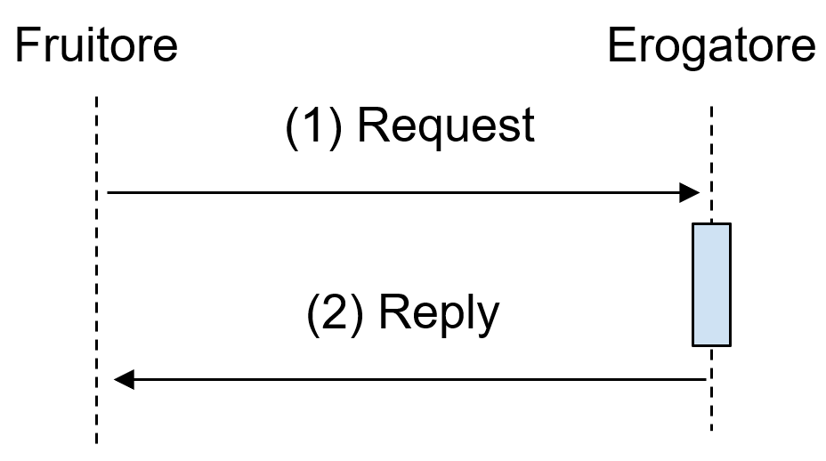

Profilo bloccante RPC
=====================

Scenario
--------

Lo sviluppo di una interfaccia bloccante di tipo RPC si richiede nei
casi in cui:

-  L’esecuzione del metodo ``M`` è poco onerosa computazionalmente e può
   essere portata immediatamente a termine dall’erogatore. In questi
   casi è accettabile per l’erogatore mantenere una connessione aperta
   in attesa di risposta.

-  Il contesto rende complessa l’implementazione delle modalità non
   bloccanti di cui alle sezioni successive. Ad esempio, non è possibile
   per il fruitore esporre una propria interfaccia di servizio ed il fruitore non può farsi carico di mantenere il
   contesto necessario ad effettuare attesa attiva.

Descrizione
-----------

   Interazione bloccante RPC

In questo profilo si ha una risposta da parte dell’erogatore contestuale
alla richiesta del fruitore. La figura mostra lo schema di questa
interazione.

Interfaccia REST
----------------

Nel caso di implementazione tramite tecnologia REST, DEVONO essere
seguite le seguenti indicazioni:

-  La specifica dell’interfaccia DEVE dichiarare tutti i codici di stato
   HTTP restituiti con relativo schema della risposta, oltre che ad
   eventuali header HTTP restituiti;

-  La specifica dell’interfaccia DEVE dichiarare lo schema della
   richiesta insieme ad eventuali header HTTP richiesti;

-  Al passo (1) il fruitore DEVE utilizzare come verbo HTTP per
   l’esecuzione della chiamata a procedura il verbo HTTP POST su un URL
   contenente gli ID interessati ed il nome del metodo;

-  Al passo (2) il fruitore DEVE utilizzare lo stato 200 OK a meno che
   non si verifichino errori.

Il corpo dei messaggi scambiati durante l’interazione deve seguire lo
standard JSON.

Regole di processamento
~~~~~~~~~~~~~~~~~~~~~~~

Al termine del processamento della richiesta, l’erogatore deve fare uso
dei codici di stato HTTP rispettandone la semantica [1]_. In
particolare, al ricevimento della richiesta da parte del fruitore,
l’erogatore DEVE almeno:

-  Verificare la validità sintattica dei dati in ingresso. In caso di
   dati errati deve restituire il codice HTTP 400 Bad Request fornendo
   nel body di risposta dettagli circa l’errore;

-  Nel caso in cui qualcuno degli ID nel path o nel body non esista,
   DEVE restituire il codice 404 Not Found, indicando nel body di
   risposta quale degli ID è mancante;

-  In caso di errori non dipendenti dal fruitore, DEVE restituire i
   codici HTTP 5XX rispettando la semantica degli stessi ed indicando
   nel body di risposta il motivo dell’errore;

-  In caso di successo restituire il codice HTTP 200 OK, riempiendo il
   body di risposta con il risultato dell’operazione.

Esempio
~~~~~~~
+--------------------+-----------------------------------------------------------------------------------------+
| Specifica Servizio | https://api.amministrazioneesempio.it/rest/v1/nomeinterfacciaservizio/RESTblocking.yaml |
+--------------------+-----------------------------------------------------------------------------------------+
| .. literalinclude:: ../media/rest-blocking.yaml                                                              |
|    :language: yaml                                                                                           |
|    :linenos:                                                                                                 |
+--------------------------------------------------------------------------------------------------------------+

Di seguito un esempio di chiamata al metodo ``M``.

+----------------------------------------------------------------+----------------------------------------------------------------------------------------+
| Http Operation                                                 | POST                                                                                   |
+----------------------------------------------------------------+----------------------------------------------------------------------------------------+
| Endpoint                                                       | https://api.amministrazioneesempio.it/rest/v1/nomeinterfacciaservizio/resources/1234/M |
+----------------------------------------------------------------+----------------------------------------------------------------------------------------+
| (1) Request Body                                               | .. code-block:: JSON                                                                   |
|                                                                |                                                                                        |
|                                                                |    {                                                                                   |
|                                                                |       "a": {                                                                           |
|                                                                |       "a1s": [1,2],                                                                    |
|                                                                |       "a2": "RGFuJ3MgVG9vbHMgYXJlIGNvb2wh"                                             |
|                                                                |       },                                                                               |
|                                                                |       "b": "Stringa di esempio"                                                        |
|                                                                |    }                                                                                   |
+----------------------------------------------------------------+----------------------------------------------------------------------------------------+
| (2) Response Body (HTTP Status Code 200 OK)                    | .. code-block:: JSON                                                                   |
|                                                                |                                                                                        |
|                                                                |    {                                                                                   |
|                                                                |      "c" : "risultato"                                                                 |
|                                                                |    }                                                                                   |
+----------------------------------------------------------------+----------------------------------------------------------------------------------------+
| (2) Response Body (HTTP Status Code 500 Internal Server Error) | .. code-block:: JSON                                                                   |
|                                                                |                                                                                        |
|                                                                |    {                                                                                   |
|                                                                |      "error_message" : "messaggio di errore"                                           |
|                                                                |    }                                                                                   |
+----------------------------------------------------------------+----------------------------------------------------------------------------------------+
| (2) Response Body (HTTP Status Code 404 Not Found)             | .. code-block:: JSON                                                                   |
|                                                                |                                                                                        |
|                                                                |    {                                                                                   |
|                                                                |      "error_message" : "la risorsa 1234 non esiste"                                    |
|                                                                |    }                                                                                   |
+----------------------------------------------------------------+----------------------------------------------------------------------------------------+

Interfaccia SOAP
-----------------

Se il profilo viene implementato con tecnologia SOAP, a differenza del
caso REST, il metodo invocato non è specificato nell’endpoint chiamato,
poichè viene identificato all’interno del body. Inoltre tutti gli ID
coinvolti DEVONO essere riportati all’interno del body. Si richiede che
il contenuto informativo del messaggio venga espresso mediante XML.

.. _regole-di-processamento-1:

Regole di processamento
~~~~~~~~~~~~~~~~~~~~~~~

Nel caso di errore il WS-I Basic Profile Version 2.0 richiede l’utilizzo
del meccanismo della SOAP fault per descrivere i dettagli dell’errore.
Al ricevimento della richiesta da parte del fruitore, l’erogatore:

-  DEVE verificare la validità sintattica dei dati in ingresso. In caso
   di dati errati deve restituire il codice HTTP 500 fornendo dettagli
   circa l’errore utilizzando il meccanismo della SOAP fault;

-  Nel caso in cui qualcuno degli ID nel path o nel body non esista,
   DEVE restituire il codice HTTP 500 indicando tramite la SOAP fault
   quale degli ID è mancante;

-  In caso di errori non dipendenti dal fruitore, DEVE restituire il
   codice HTTP 500, indicando il motivo dell’errore nella SOAP fault;

-  In caso di successo restituire il codice HTTP 200 OK, riempiendo il
   body di risposta con il risultato dell’operazione.

.. _esempio-1:

Esempio
~~~~~~~
+-----------------------------------------------------------+----------------------------------------------------------------------------+
| Specifica Servizio                                        | https://api.amministrazioneesempio.it/soap/nomeinterfacciaservizio/v1?wsdl |
+-----------------------------------------------------------+----------------------------------------------------------------------------+
| .. literalinclude:: ../media/soap-blocking.wsdl                                                                                        |
|    :language: xml                                                                                                                      |
|    :linenos:                                                                                                                           |
+-----------------------------------------------------------+----------------------------------------------------------------------------+

A seguire un esempio di chiamata al metodo ``M``.

+---------------------------------------------------------------+------------------------------------------------------------------------------------------------------------+
| Endpoint                                                      | https://api.amministrazioneesempio.it/soap/nomeinterfacciaservizio/v1                                      |
+---------------------------------------------------------------+------------------------------------------------------------------------------------------------------------+
| Method                                                        | M                                                                                                          |
+---------------------------------------------------------------+------------------------------------------------------------------------------------------------------------+
| 1. Request Body                                               | .. code-block:: XML                                                                                        |
|                                                               |                                                                                                            |
|                                                               |                                                                                                            |
|                                                               |     <?xml version="1.0"?>                                                                                  |
|                                                               |                                                                                                            |
|                                                               |     <soap:Envelope                                                                                         |
|                                                               |           xmlns:soap="http://www.w3.org/2003/05/soap-envelope/"                                            |
|                                                               |           soap:encodingStyle="http://www.w3.org/2003/05/soap-encoding">                                    |
|                                                               |                                                                                                            |
|                                                               |         <soap:Header>                                                                                      |
|                                                               |                                                                                                            |
|                                                               |           <!--Autenticazione-->                                                                            |
|                                                               |         </soap:Header>                                                                                     |
|                                                               |                                                                                                            |
|                                                               |         <soap:Body xmlns:m="http://api.amministrazioneesempio.it/nomeinterfacciaservizio">                 |
|                                                               |         <m:M>                                                                                              |
|                                                               |           <m:oId>1234</m:oId>                                                                              |
|                                                               |           <m:a>                                                                                            |
|                                                               |             <m:a1s><a1>1</a1>...<a1>2</a1></m:a1s>                                                         |
|                                                               |             <m:a2>RGFuJ3MgVG9vbHMgYXJlIGNvb2wh</m:a2>                                                      |
|                                                               |           </m:a>                                                                                           |
|                                                               |           <m:b>Stringa di esempio</m:b>                                                                    |
|                                                               |         </m:M>                                                                                             |
|                                                               |         </soap:Body>                                                                                       |
|                                                               |                                                                                                            |
|                                                               |     </soap:Envelope>                                                                                       |
+---------------------------------------------------------------+------------------------------------------------------------------------------------------------------------+
| 2. Response Body (HTTP status code 200 OK)                    | .. code-block:: XML                                                                                        |
|                                                               |                                                                                                            |
|                                                               |     <?xml version="1.0"?>                                                                                  |
|                                                               |                                                                                                            |
|                                                               |     <soap:Envelope                                                                                         |
|                                                               |     xmlns:soap="http://www.w3.org/2003/05/soap-envelope/"                                                  |
|                                                               |     soap:encodingStyle="http://www.w3.org/2003/05/soap-encoding">                                          |
|                                                               |                                                                                                            |
|                                                               |     <soap:Body xmlns:m="http://amministrazioneesempio.it/nomeinterfacciaservizio">                         |
|                                                               |     <m:MResponse>                                                                                          |
|                                                               |       <return>                                                                                             |
|                                                               |         <m:c>OK</m:c>                                                                                      |
|                                                               |       </return>                                                                                            |
|                                                               |     </m:MResponse>                                                                                         |
|                                                               |     </soap:Body>                                                                                           |
|                                                               |                                                                                                            |
|                                                               |     </soap:Envelope>                                                                                       |
+---------------------------------------------------------------+------------------------------------------------------------------------------------------------------------+
| 2. Response Body (HTTP status code 500 Internal Server Error) | .. code-block:: XML                                                                                        |
|                                                               |                                                                                                            |
|                                                               |                                                                                                            |
|                                                               |     <?xml version="1.0"?>                                                                                  |
|                                                               |                                                                                                            |
|                                                               |     <soap:Envelope xmlns:soap="http://schemas.xmlsoap.org/soap/envelope/">                                 |
|                                                               |       <soap:Body>                                                                                          |
|                                                               |         <soap:Fault>                                                                                       |
|                                                               |            <faultcode>soap:Server</faultcode>                                                              |
|                                                               |            <faultstring>Error</faultstring>                                                                |
|                                                               |            <detail>                                                                                        |
|                                                               |               <ns2:ErrorMessageFault xmlns:ns2="http://amministrazioneesempio.it/nomeinterfacciaservizio"> |
|                                                               |                  <customFaultCode>1234</customFaultCode>                                                   |
|                                                               |               </ns2:ErrorMessageFault>                                                                     |
|                                                               |            </detail>                                                                                       |
|                                                               |         </soap:Fault>                                                                                      |
|                                                               |      </soap:Body>                                                                                          |
|                                                               |     </soap:Envelope>                                                                                       |
+---------------------------------------------------------------+------------------------------------------------------------------------------------------------------------+

.. [1]
   http://www.iana.org/assignments/http-status-codes/http-status-codes.xhtml
