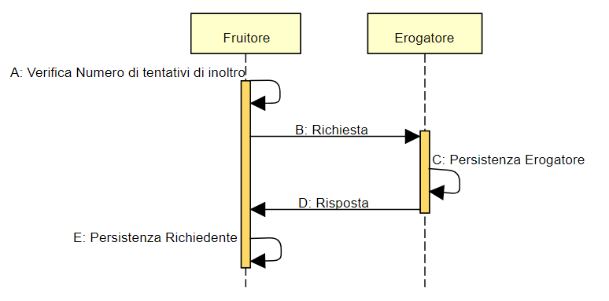

Soluzioni di sicurezza
======================

Soluzione per confidenzialità ed autenticazione del soggetto richiedente
------------------------------------------------------------------------

.. _scenario-8:

Scenario
^^^^^^^^

Dare seguito ad uno scambio tra richiedente ed erogatore che garantisca:

-  la confidenzialità a livello di canale

-  l’autenticazione del soggetto Fruitore

Il soggetto fruitore potrebbe non coincidere con l’unità organizzativa
richiedente, ma comunque appartenere alla stessa.

Questa soluzione utilizza i seguenti profili:

-  **M2MC01**

-  **M2MS01** o in alternativa **M2MR01**

Precondizioni
^^^^^^^^^^^^^

Si assume l’esistenza di un trust tra richiedente ed erogatore che
stabilisce:

-  riconoscimento da parte dell’erogatore dei certificati X.509, o la CA
   emittente, relative al soggetto fruitore

-  riconoscimento da parte del richiedente del certificato X.509, o la
   CA emittente, relative al soggetto erogatore

Il meccanismo con cui è stabilito il trust non condiziona quanto
descritto nella sezione.

.. _flusso-delle-interazioni-8:

Flusso delle interazioni
^^^^^^^^^^^^^^^^^^^^^^^^

**A: Richiesta**

Il messaggio di richiesta viene firmato utilizzando il profilo
**M2MS01** nel caso di utilizzo di SOAP o **M2MR01** nel caso di
utilizzo di REST, per garantire:

-  l’autenticazione dell’identità del soggetto fruitore

Il richiedente invia il messaggio di richiesta all’interfaccia di
servizio dell’erogatore.

Il messaggio viene trasmesso su un canale sicuro utilizzando il profilo
**M2MC01** per garantire:

-  la confidenzialità a livello di canale.

**B: Risposta**

L’erogatore da seguito a quanto previsto nel profilo **M2MS01** nel caso
di utilizzo di SOAP o **M2MR01** nel caso di utilizzo di REST

Soluzioni per la non ripudiabilità della trasmissione
-----------------------------------------------------

.. _scenario-9:

Scenario
^^^^^^^^

Dare seguito ad uno scambio tra richiedente ed erogatore che garantisca
la non ripudiabilità [8] assicurando a livello di messaggio:

-  integrità del messaggio

-  autenticazione del soggetto richiedente, quale organizzazione o unità
   organizzativa richiedente quale mittente del contenuto

-  conferma da parte dell’erogatore della ricezione del contenuto

-  opponibilità ai terzi

-  robustezza della trasmissione

Il presente scenario utilizza come modello di comunicazione i Profili di
Interazione Bloccante, ed è possibile implementarlo indipendentemente
con SOAP e REST.

Questa soluzione utilizza i seguenti profili:

-  **M2MC01** o in alternativa **M2MC02**

-  **M2MS03** o in alternativa **M2MR03**

.. _precondizioni-1:

Precondizioni
^^^^^^^^^^^^^

Si assume che il certificato che garantisce l’integrità del messaggio e
l’autenticazione del Fruitore è lo stesso.

Si assume che il certificato che garantisce l’integrità del messaggio di
conferma e l’autenticazione dell’Erogatore è lo stesso.

Si assume l’esistenza di un trust tra richiedente ed erogatore che
stabilisce:

-  reciproco riconoscimento da parte dell’erogatore e del fruitore dei
   certificati X.509, o le CA emittenti.

Il meccanismo con cui è stabilito il trust non condiziona quanto
descritto nella sezione.

Il richiedente ed erogatore devono concordare:

-  il tempo di validità della transazione che intercorre tra:

   -  l’istante di inoltro del richiedente

   -  l’istante di ricezione dell’erogatore;

-  il tempo massimo di attesa del richiedente del messaggio di risposta
   per ritenere la comunicazione non avvenuta;

-  il numero massimo di tentativi di rinvio da parte del richiedente
   accettati dall’erogatore;

-  eventuale utilizzo di canali alternativi (quali ad esempio PEC,
   Contact Center, ...) per superare o evidenziare problemi di
   comunicazione riscontrati;

-  un identificativo univoco del messaggio, necessario a garantire il
   riscontro di ritrasmissioni, e le relative modalità di scambio;

-  l’arco temporale di persistenza dei messaggi che dipende dalle
   caratteristiche del contenuto dei dati scambiati e nel rispetto delle
   norme di legge.

Attraverso le tecnologie di criptazione sono garantite le seguenti
proprietà:

-  integrità e non ripudio del messaggio inviato dal richiedente

-  integrità e non ripudio del messaggio di conferma da parte
   dell’erogatore

-  autenticazione del soggetto richiedente

-  autenticazione del soggetto erogatore

-  validazione temporale che certifichi l’istante in cui il messaggio è
   stato trasmesso

-  validazione temporale che certifichi l’istante in cui il messaggio è
   stato ricevuto.

.. _flusso-delle-interazioni-9:

Flusso delle interazioni
^^^^^^^^^^^^^^^^^^^^^^^^

   
**A: Verifica numero tentativi di inoltro**

Il richiedente realizza una delle seguenti azioni:

**A.1 [Primo Invio]**

Il richiedente inizializza il numero di tentativi di inoltro ad 1 e
prosegue a quanto indicato al passo B.

**A.2 [Invio Successivo con numero di tentativi inferiore al massimo
pattuito]**

Il richiedente incrementa il numero di tentativi di inoltro e da seguito
a quanto indicato al passo B.

**A.3 [Superamento numero di tentativi massimi pattuiti]**

Il richiedente utilizza i canali alternativi (quali ad esempio PEC,
Contact Center, ...) per superare o evidenziare problemi di
comunicazione riscontrati non proseguendo con i passi successivi.

**B: Richiesta**

Il messaggio di richiesta viene costruito aggiungendo l’identificativo
univoco così come concordato tra le parti e l’istante di trasmissione

-  **SOAP**: <*wsu:Timestamp*> della ws-security

-  **REST:** claim *iat* contenuta nella payload del token JWT

Il payload e l’istante di trasmissione vengono firmati, utilizzando il
profilo **M2MS03** nel caso di utilizzo di SOAP o **M2MR03** nel caso di
utilizzo di REST, per garantire:

-  l’integrità del contenuto,

-  l’autenticazione dell’identità del mittente

-  l’autenticità del momento di invio.

Il richiedente invia il messaggio di richiesta all’interfaccia di
servizio dell’erogatore.

Il messaggio viene trasmesso su un canale sicuro per garantire:

-  la confidenzialità a livello di canale (almeno profilo **M2MC01**)

**C: Persistenza Erogatore**

Per garantire la non ripudiabilità del messaggio ricevuto dal
richiedente, così come previsto dai profili utilizzati:

-  L’erogatore provvede all’autenticazione del richiedente;

-  L’erogatore verifica l’integrità del messaggio firmato, inoltre la
   presenza dell’istante di trasmissione nel messaggio, ne garantisce
   validità a lungo termine;

Per assicurare l’opponibilità a terzi:

-  L’erogatore rende persistente il messaggio firmato tracciando
   l'istante di ricezione.

La persistenza del messaggio:

-  DEVE garantire la capacità di ricercare ed esportare le informazioni
   memorizzate;

-  DEVE essere garantita per un periodo di tempo che dipende dagli
   accordi tra le parti.

L’erogatore realizza una delle seguenti azioni:

**C.1 [Prima Ricezione]**

L’erogatore inizializza il numero di tentativi di richieste ricevute ad
1 e prosegue al passo D.

**C.2 [Duplicato con numero di tentativi inferiore al massimo
pattuito]**

L’erogatore accerta la presenza di un identificativo univoco del
messaggio già ricevuto, a causa di una mancata ricezione del messaggio
di conferma da parte del richiedente.

Incrementa il numero di tentativi di richieste ricevute e prosegue al
passo D.

**C.3 [Superamento numero massimo di tentativi pattuiti]**

L’erogatore accerta la presenza di un identificativo univoco del
messaggio già ricevuto, a causa di una mancata ricezione del messaggio
di conferma da parte del richiedente.

L’erogatore accerta di aver raggiunto il numero massimo di tentativi di
richieste ricevute. L’erogatore utilizza i canali alternativi (quali ad
esempio PEC, Contact Center, ...) per superare o evidenziare problemi di
comunicazione riscontrati non proseguendo con i passi successivi.

**D: Risposta**

L’erogatore costruisce un messaggio di conferma includendo un
identificativo che permetta di associare univocamente al messaggio di
richiesta (ad esempio il digest presente nel messaggio di richiesta) e
l’istante di trasmissione.

Inoltre al messaggio di conferma viene aggiunto l’istante di
trasmissione

-  **SOAP**: <*wsu:Timestamp*> della ws-security

-  **REST:** claim *iat* contenuta nella payload del token JWT

Il payload e l’istante di trasmissione vengono firmati, utilizzando il
profilo **M2MS03** nel caso di utilizzo di SOAP ed **M2MR03** nel caso
di utilizzo di REST, per garantire:

-  l’integrità del contenuto,

-  l’autenticazione dell’identità del mittente

-  l’autenticità del momento di invio.

**E: Persistenza Richiedente**

Per garantire la non ripudiabilità del messaggio inviato all’erogatore:

-  Il richiedente provvede all’autenticazione dell’erogatore rispetto al
   messaggio di risposta.

-  Il richiedente verifica l’integrità del messaggio di risposta firmato
   in cui, la presenza del timestamp sul protocollo di messaggio ne
   garantisce validazione a lungo termine e il tempo di ricezione.

ed inoltre per assicurare l’opponibilità a terzi:

-  Il richiedente rende persistente il messaggio di risposta firmato.

La persistenza del messaggio deve:

-  garantire la capacità di ricercare ed esportare le informazioni
   memorizzate;

-  essere garantita per un periodo di tempo che dipende dagli accordi
   tra le parti.

**Note**

Nel caso in cui il richiedente non riceve il messaggio di risposta entro
i termini concordati tra le parti, si ritiene la comunicazione non
conclusa, in quanto può presentarsi uno dei seguenti casi:

-  il messaggio di richiesta non ha raggiunto l’erogatore

-  il messaggio di richiesta ha raggiunto l’erogatore ma non ha ricevuto
   il messaggio di risposta.

In queste situazioni il richiedente riesegue il passo A.
